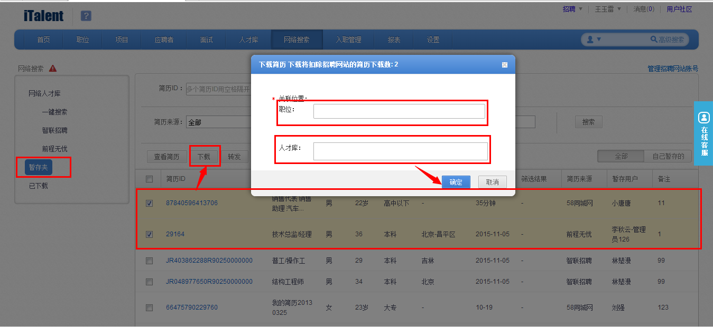

# 10.2 简历搜索、下载

根据关键字段，进行简历搜索，可直接下载或暂存。

备注：
1、下载会扣除点数，需谨慎操作！

2、下载会进行查重，如系统中存在相似简历，会有相关提示，如下图：
 

 
3、招聘业务人员将按照关键字或者职位ID搜索出来的简历，可以按照“备注”信息分类进行存放到暂存夹下面，这样方便业务人员分类进行管理，如下图：

4、通过暂存夹下的“备注”关键字段，进行检索简历，可以将简历发给相应的用人部门进行筛选，根据用人部门反馈的筛选结果，最终下载简历，推送到已发布的职位上或者存放到人才库里面，如下图：
 

