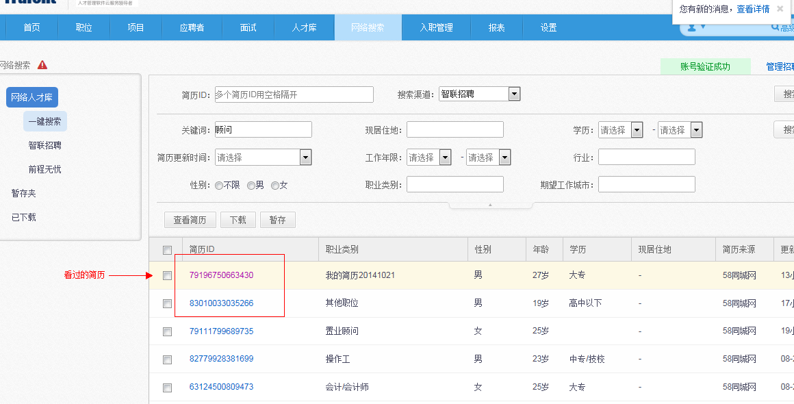

# 10 网络搜索

1.网络搜索

2.可实现五大渠道网站的简历搜索及下载：

3.网络搜索除了可一键搜索5个渠道的简历外，支持独立搜索智联招聘和前程无忧的简历，搜索更加精准

4.对搜索出的结果进行高亮显示，以便快速判断筛选

 

5.搜索列表将之前招聘网站默认的按相关性排序，改为按时间排序

说明：

**1、一键搜索出来的智联简历默认按简历更新时间排序； 

**2、一键搜索出来的前程简历默认按简历ID的大小排序，前程的后台有一个排序设置，默认是按简历ID的大小排序，如果将这个设置为按时间，就可以按简历更新时间进行排序，此时通过招聘系统搜索出来的简历也会按照简历更新时间进行排序。** 
**