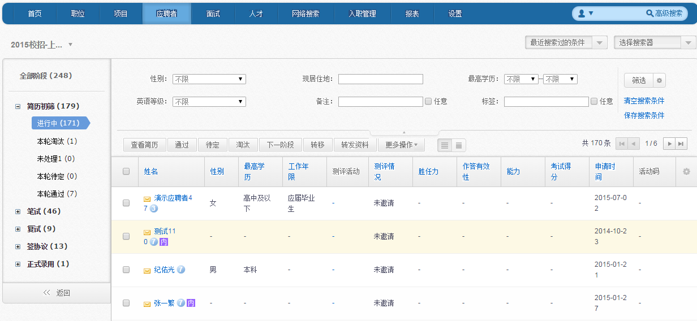
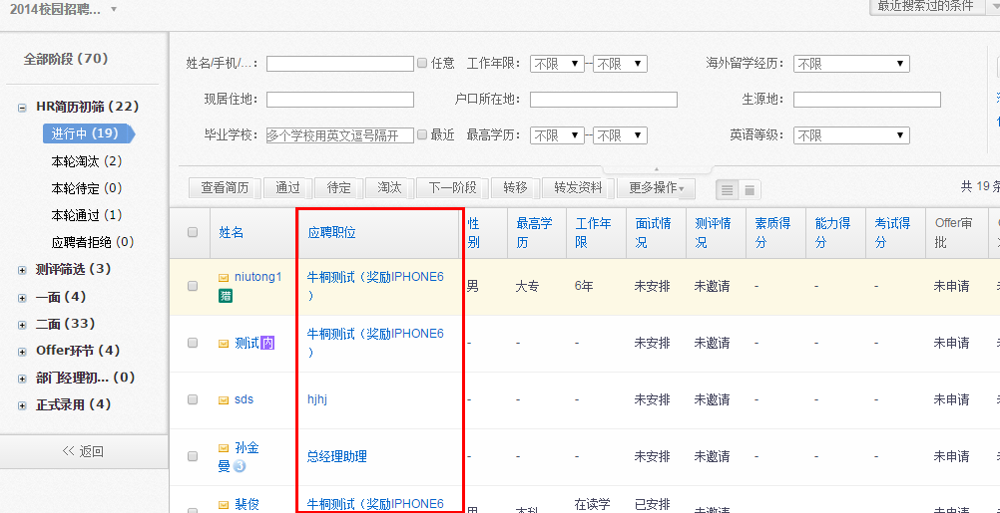
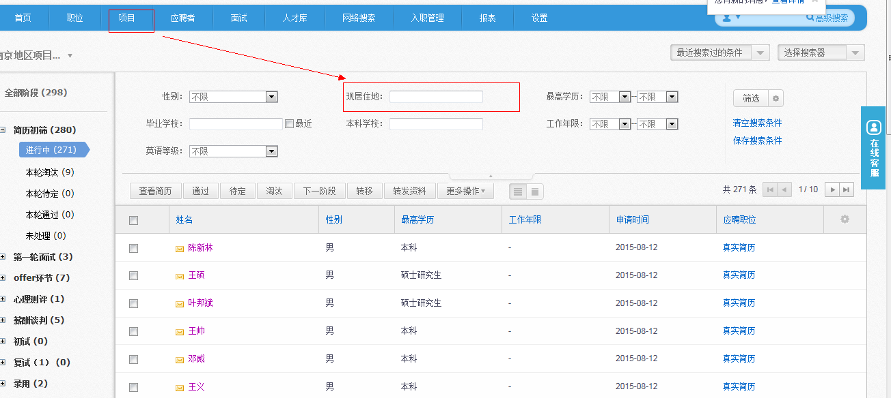

# 3.3.2 第二步 简历处理

(1)在进入的应聘者界面，可对此项目下所有职位的应聘者按照阶段进行统一操作。具体操作同单一职位下操作。

**注意：在项目下进行的操作，会同时反映在职位下。如，在项目下将某应聘者淘汰，则其所在职位下会同步淘汰。**

(2)应聘职位一栏可显示该应聘者应聘的职位，若不同职位有相同的应聘者，将会有两条记录，方便区分以及操作。

(3)在项目中，可指定”面试地点”条件。

(4) 指定后 ，用户可以在项目中加载出满足“流程+职位+面试地点”的应聘者申请，例如，2015校招华北站=2015校招流程+相关职位+华北站。

