# 4.2 查看各环节下的应聘者

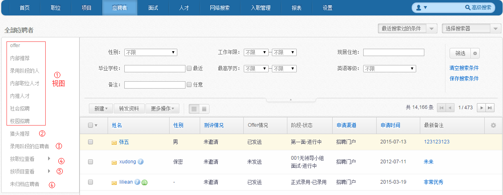

1）	选择相应视图，可以查看所有该视图下的所有应聘者：

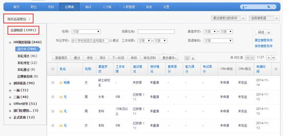

2）	选择“猎头推荐”，可以看到所有猎头推荐进来的应聘者。

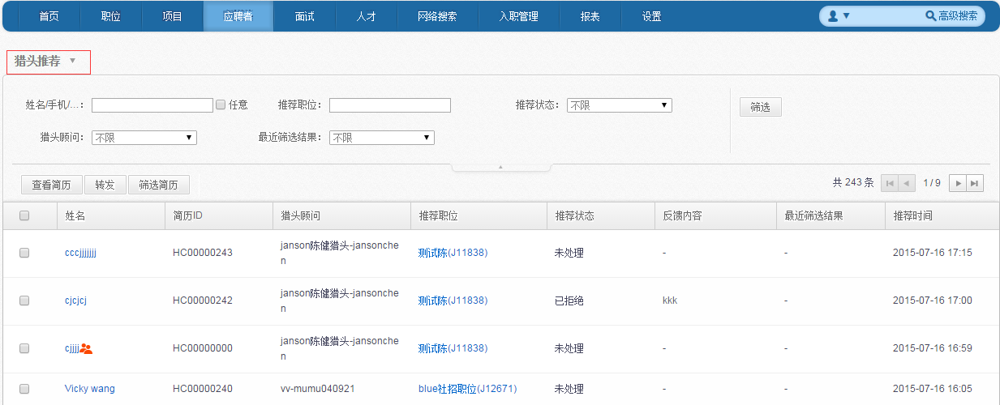

3）	选择“录用阶段的应聘者”，则可以看到处于正式录用阶段的所有应聘者，具体页面如图所示：

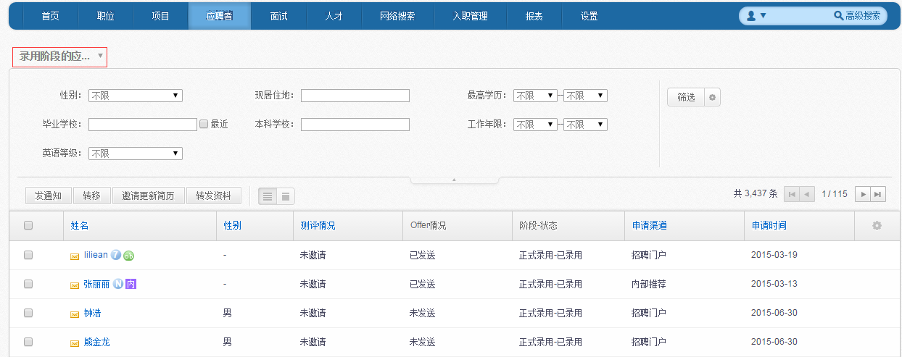

在此阶段下，可以按照不同的录用状态来查看各个状态的应聘者。同时还能在此阶段进行邀请更新简历，转移应聘者的状态等操作。

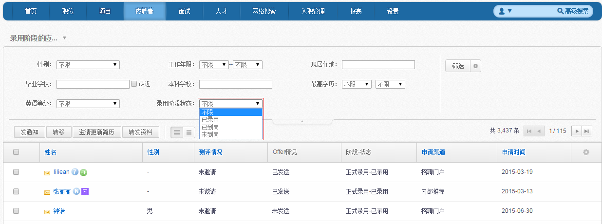

4）	按职位查看
选择想要查看的职位，则可以看到该职位下的应聘者，如图：

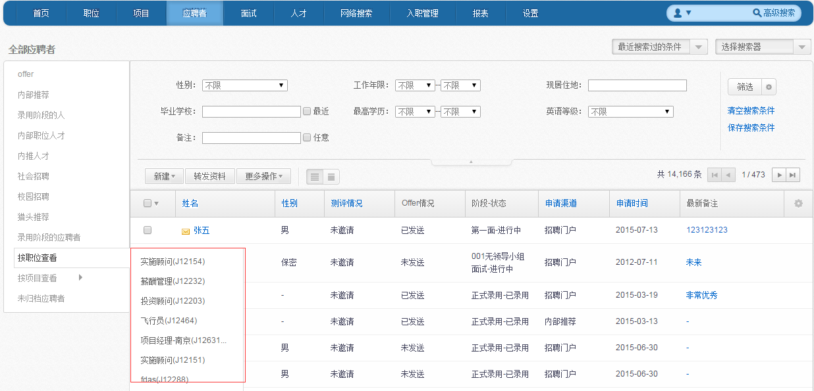

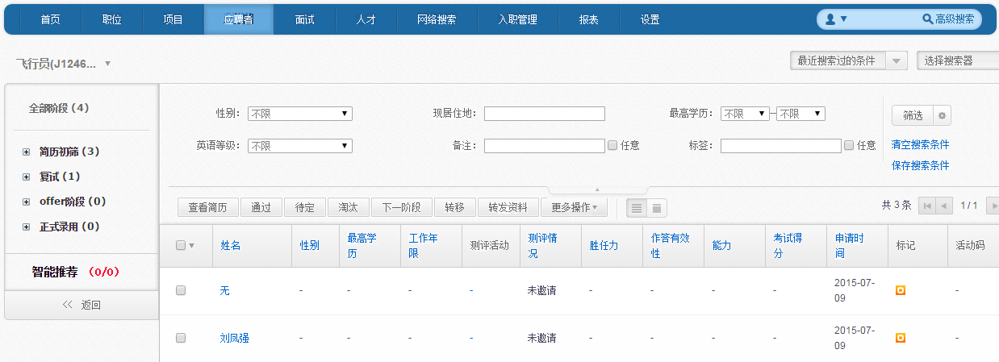
 
5）	按项目查看
选择想要查看的项目，则可以看到该项目下的应聘者，如图：

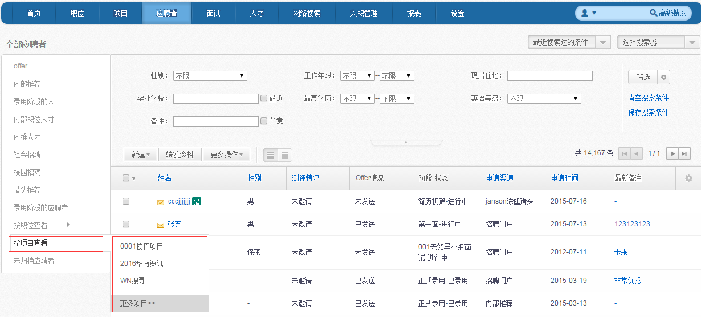

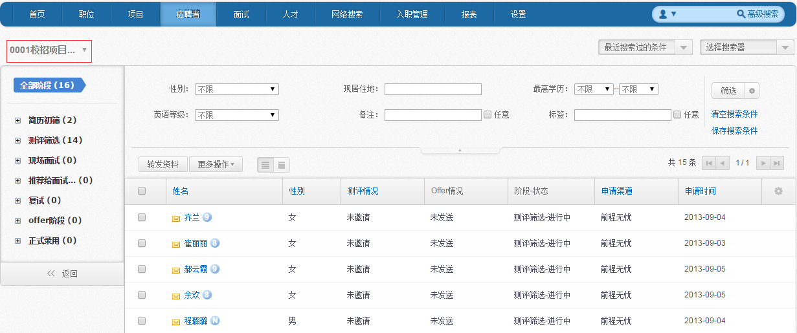
 
6）	选择“未归档应聘者”，可以进入简历归档页面，可以选择简历归档至相应的职位或人才库下。

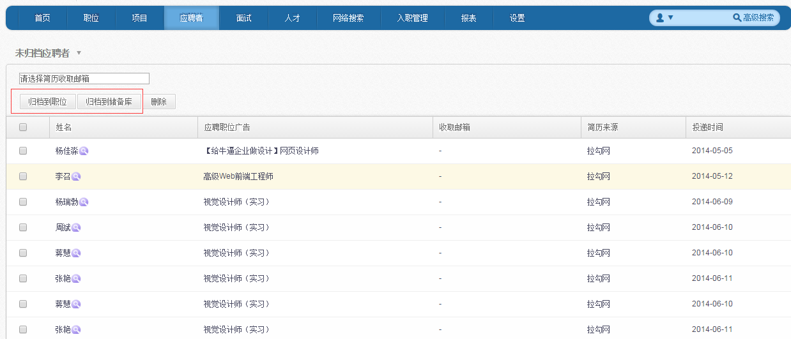

PS：简历归档规则的设置见本手册“**9.1.2简历归档规则**”

7）	锁定应聘者：

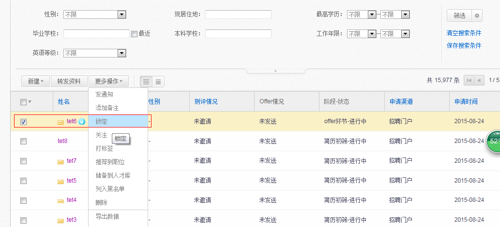
 
