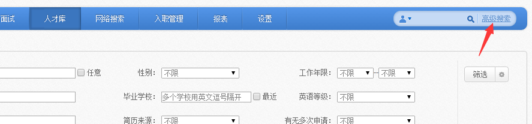
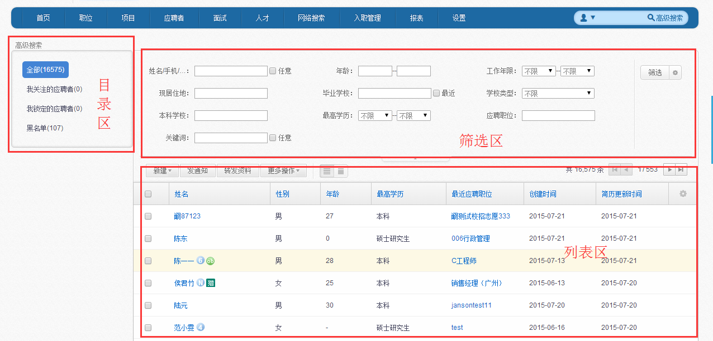

# 6.1 高级搜索

 

可查询系统内所有应聘者的信息，还可进行简历导入操作。同时针对应聘者进行推荐职位、打标签等操作。

说明：

1、	目录区：可根据需求选择所要查看的关注点，系统默认为企业人才库的全部展示。

2、	筛选区：可根据筛选条件，进行相关简历的搜索；还可通过右边的小齿轮设置所要筛选的条件

3、	列表区：符合搜索条件的应聘者相关信息展示，还可通过右边的小齿轮，设置简历列表的展示项。

4、	列表区的蓝色字样可进行排序
 

 
5、	列表区展示项的顺序，可通过鼠标拖动进行调整
