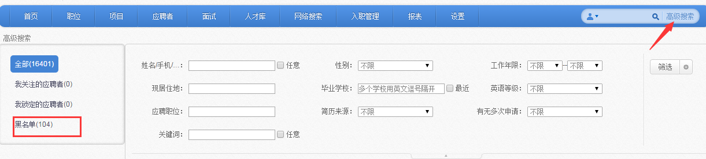
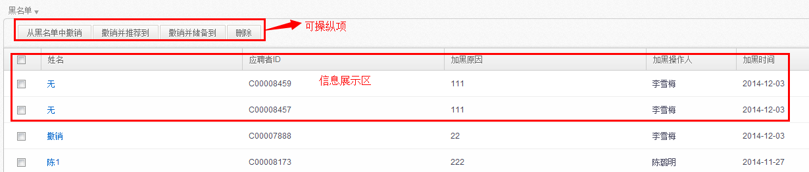

# 6.4 黑名单

可查看被放入黑名单的应聘者详情，并可对这些应聘者进行解除黑名单的操作。操作同“**2.5.3.3.1.4黑名单**”

备注：放入黑名单的应聘者，在应聘者模块及其他人才库中不显示，只有释放后方可进行相关操作。

其中：

【从黑名单中撤销】：可将相关应聘者移出黑名单库，那么在其他库中便能看到该应聘者，并对其进行推荐、邀请等操作；

【撤销并推荐到】：移出黑名单列表，同时直接将该应聘者推荐到相关职位下，以便进行面试安排等操作；

【撤销并储备到移出黑名单列表】，同时将该应聘者储备到相关人才库下；

【删除】：删除该应聘者，那么其相关信息将全部被删除，在系统中将彻底不存在，此功能慎用。
