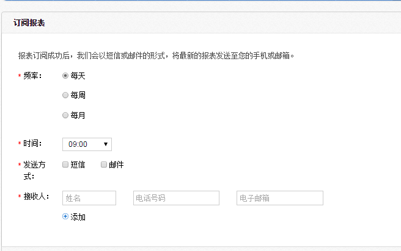

# 8.5 自定义报表功能

北森的报表可以导出，如既定的报表无法满足需要，也可以自定义报表。

通过**biset.beisen.com——报表设计器（需开通）**；

具体支持如下功能（配置该报表暂时由北森实施或CSM负责，最终用户暂时不开放）：

**（1）拖拽所需的维度字段，支持任意字段的关联；**

**（2）拖拽度量值，生成计数指标；**

**（3）拖拽字段到‘分组列’，让度量值横向展示；**

**（4）添加‘过滤条件’；**

**（5）添加‘条件设置’；**

**（6）设置‘报表可选字段’；**

**（7）设置字段别名；**

**（8）设置‘分组列’；**

**（9）单选类的自定义字段，可以作为过滤条件；**

**（10）设置计算字段，增加时间字段格式；**

注意：配置完毕后，用户可直接使用，如需调整请联系北森方。

任何一张报表均可以订阅，在规定的时间发给订阅人，如下图：

