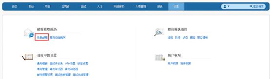

# 9.1.1 收取邮箱

在“设置”模块，点击“收取邮箱”。

点击“新建”按钮。

进入新增邮箱页面。

1.邮箱地址：输入邮箱全称，此邮箱必须支持pop协议。

2.用户名：一般是自动调取邮箱@前的部分，但是如果邮箱测试一直不成功的情况下，也可以手动输入邮箱全称。

3.密码：登陆邮箱密码。

4.Pop3服务器地址：目前新浪、163、QQ邮箱，系统都能自动调取pop3服务器地址，对于企业邮箱，可以咨询公司网管，提供此地址即可。

5.端口号：同上，对于企业邮箱，咨询公司网管，一般是110.

6.需要安全密码验证和要求ssl安全连接测试的要求，可以咨询公司网管。点击邮箱测试，如果测试成功，则表明邮箱配置成功；如果测试失败，则要继续检验各项信息是否准确，直到测试成功为止。

7.系统可以设置邮箱只收取某个时间段之后的邮件。

8.如果勾选，则原邮箱中保留备份，否则简历收取进系统后，原邮箱中不再保留邮件。

9.智能识别简历邮件:是指招聘网站上手动推送的简历或者应聘者直接投递进邮箱的简历，也都可以进行识别和解析。

10.如果想让其他用户看到此邮箱收取的简历，则只需授权给他即可，招聘管理员默认能看到所有邮箱里的简历。
