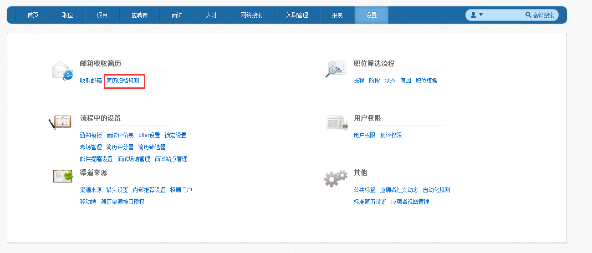
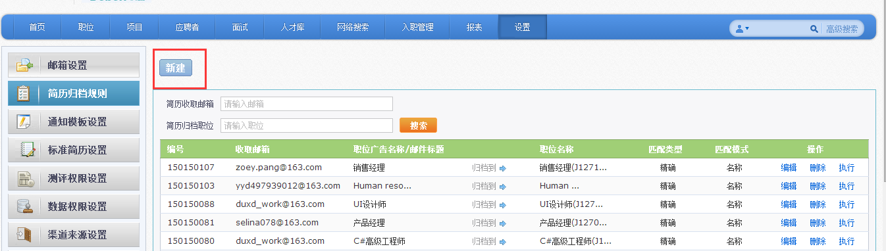
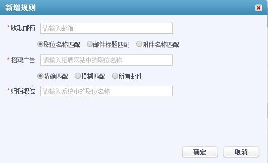
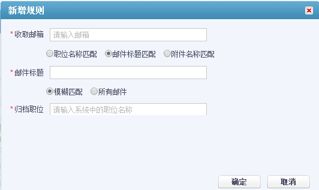
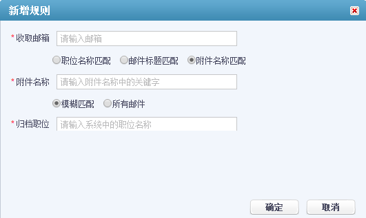

# 9.1.2 简历归档规则

在“设置”模块，点击“简历归档规则”。

点击“新建”按钮。

进入新建简历归档规则页面。

**1、按照职位名称进行匹配：将系统中的职位名称与邮箱中收录进来的简历对应的职位名称进行匹配。**

  
(1)精确匹配：邮箱中简历对应的职位名称与系统中职位名称完全一致，才可以归档到    
系统中对应的职位下。

(2)模糊匹配：邮箱中简历对应的职位名称与系统中职位名称关键字一致，就可以归档
到系统中对应的职位下。
  
(3)所有邮件：是指邮箱中所有简历可以归档到系统中某一职位中。

**2、按照邮件标题进行匹配：将邮件标题与系统中职位名称进行匹配。 **

(1)模糊匹配：邮件标题与系统中职位名称的关键词一致，就可以将简历归档到对应职位下。

(2)所有邮件：将邮箱中所有简历归档到系统中对应职位下。

**3、按照附件名称进行匹配：将邮件附件的名称与系统中的职位名称进行匹配。**

(1)模糊匹配：邮件附件的名称与系统中职位名称的关键词一致，就可以归档到对应职
位下。

(2)所有邮件：将邮箱中所有简历归档到系统中对应职位下。
