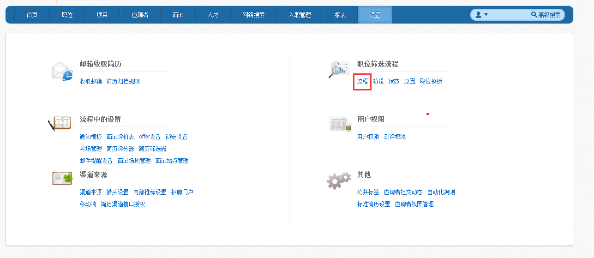
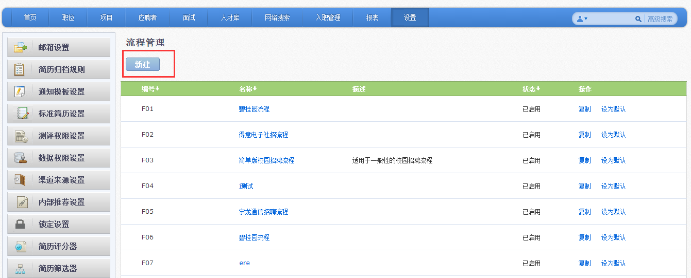
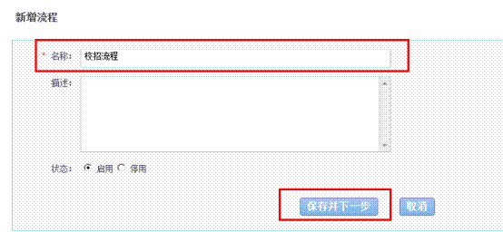
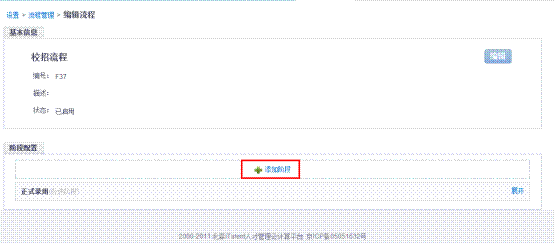
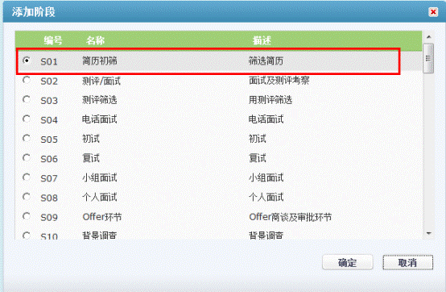
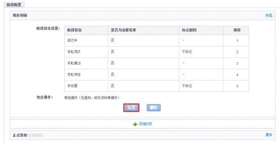
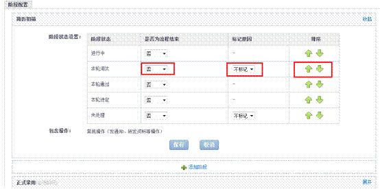
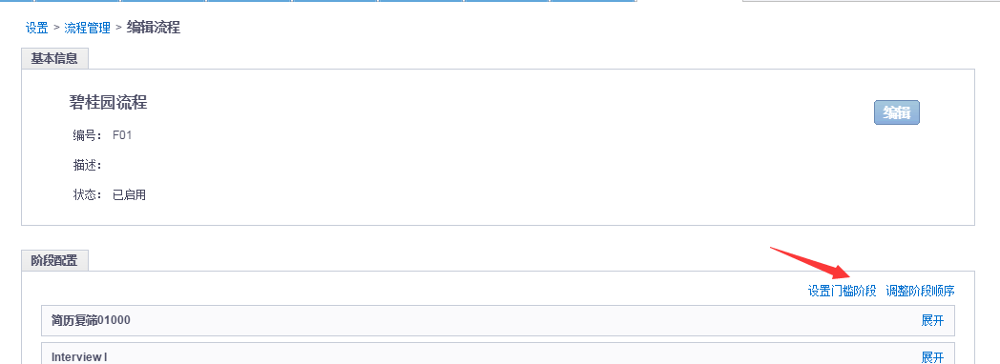
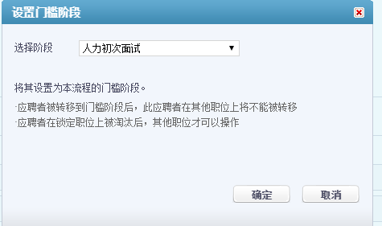

# 9.2.4 流程

根据实际招聘业务，将各个阶段组合成实际的招聘流程。 
点击新增，增加新流程。

 
输入流程的名称，选择保存并下一步。

点击添加阶段，选择流程中使用的阶段。

 
选择设置，可选择各状态是否需要标记原因、调整阶段的顺序，以及是否为流程结束。

流程是否结束：若此状态代表此应聘者全部招聘过程已结束，择选为是。 

标记原因：若选为标记，择转移到此阶段时，需要选择相应原因。 

Ps：只有在状态管理中，为此状态选择了原因的状态，在此处才可选择是否需要标记原因。 

点击排序处的箭头，可调整各状态的位置。

门槛阶段：

当应聘者到达某一个阶段后，自动锁定该应聘者，其他人不可操作，直到该应聘者淘汰其他人方可操作。

 
