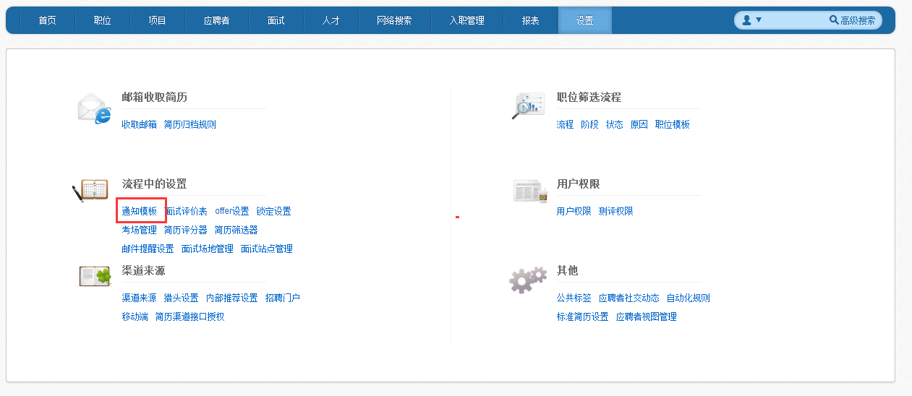
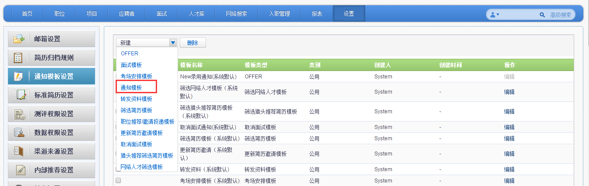
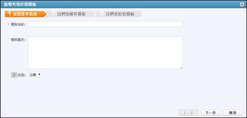

# 9.3.1 通知模板

在“设置”模块，点击“通知模板。

#### 9.3.1.1 通知模板

点击【新建】按钮，选中“通知模板”。

进入新增“通知模板”页面。

1、	输入“模板名称”。

2、	模板描述：非必填项，方便在后期选择模板。

3、	类别：可以选择“公用”或“个人”。公用代表所有人可见；个人代表仅自己可见。

点击【下一步】，进入“新建通知邮件模板”页面。

注：“应聘者姓名”，“应聘者ID”，“职位名称”，“发送时间”这些灰色模块代表系统自动抓取的内容。

点击【下一步】，进入“新建通知短信模板”页面。

注：短信尽量不要超过61个字符，否则会拆分成两条，浪费短信条数。

点击完成，即可完成“通知模板”的新建。

#### 9.3.1.2 面试模板

点击【新建】按钮，选中“面试模板”。

进入新增“面试模板”页面。

1、	输入“模板名称”。

2、	模板描述：非必填项，方便在后期选择模板。

3、	类别：可以选择“公用”或“个人”。公用代表所有人可见；个人代表仅自己可见。

点击【下一步】，进入配置应聘者和面试官邮件和短信模板页面。
 

 

#### 9.3.1.3 offer模板

点击【新建】按钮，选中“offer模板”。

进入新增“offer模板”界面。

1、	输入“模板名称”。

2、	模板描述：非必填项，方便在后期选择模板。

3、	类别：可以选择“公用”或“个人”。公用代表所有人可见；个人代表仅自己可见。

点击【下一步】，进入“offer邮件模板”页面。

点击【下一步】，进入“offer短信模板”页面。

#### 9.3.1.4 转发资料模板

点击【新建】按钮，选择“转发资料”模板。

进入新增“转发资料”模板。

1、输入“模板名称”。

2、模板描述：非必填项，方便在后期选择模板。

3、类别：可以选择“公用”或“个人”。公用代表所有人可见；个人代表仅自己可见。

点击【下一步】，进入“转发资料”邮件模板页面，转发资料没有短信模板通知。

#### 9.3.1.5 筛选简历模板

点击【新建】按钮，选择“筛选简历”模板。

进入“新增筛选简历模板”页面。

点击【下一步】，进入筛选简历邮件模板。

#### 9.3.1.6 考场安排模板

点击【新建】，进入“考场安排模板”。

进入“考场安排模板”

点击【下一步】，进入邮件模板配置。

点击【下一步】，进入短信配置模板。

#### 9.3.1.7 职位推荐、邀请投递模板

点击【新建】，进入“职位推荐，邀请投递模板”页面。

进入“职位推荐，邀请投递模板”页面。

点击【下一步】，进入“邮件模板”配置。

点击【下一步】，进入“短信模板”配置。

9.3.1.8 更新简历邀请模板
点击【新建】，选择“更新简历邀请”模板。
 
进入“更新简历邀请模板”的新建页面。
 
1、输入“模板名称”。
2、模板描述：非必填项，方便在后期选择模板。
3、类别：可以选择“公用”或“个人”。公用代表所有人可见；个人代表仅自己可见。
点击【下一步】，进入“邮件模板”页面。
 
点击【下一步】，进入“短信模板”页面。
 

