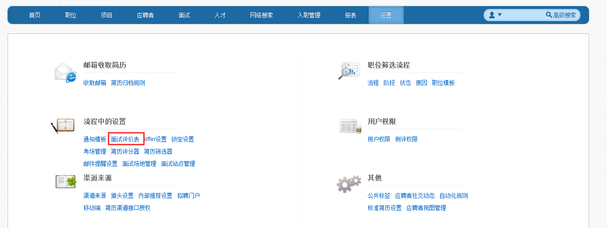
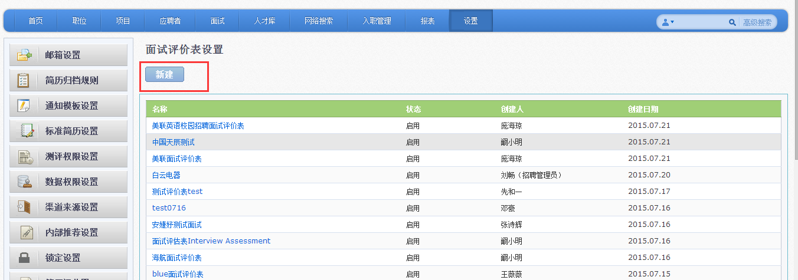
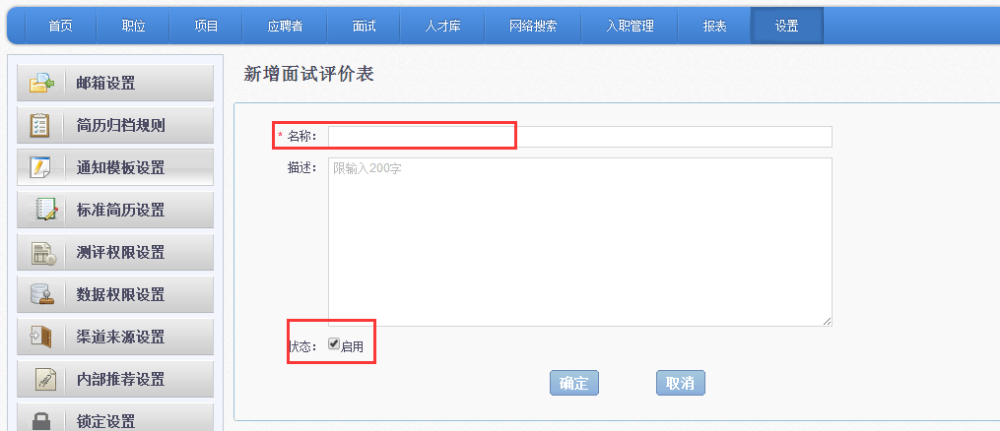
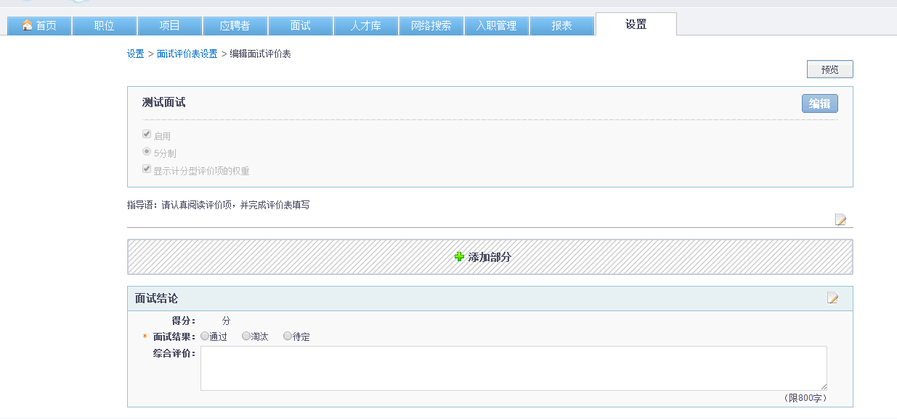
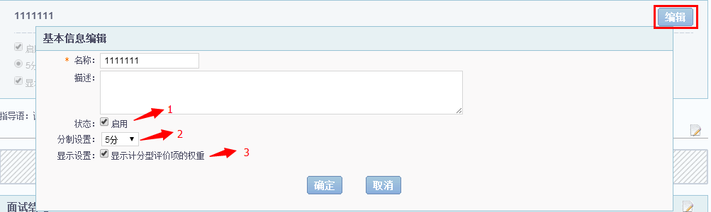
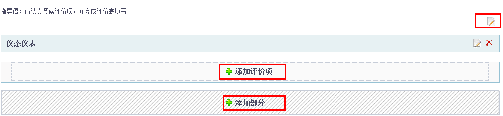
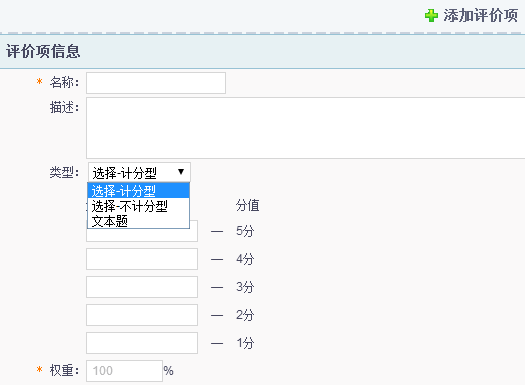
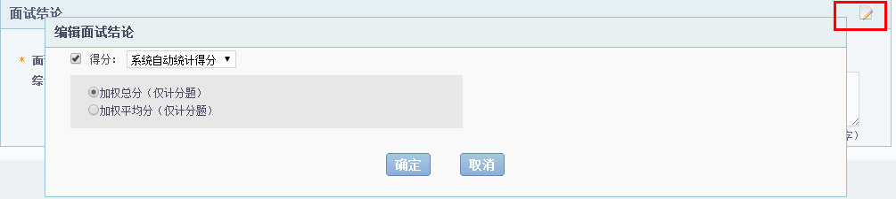

# 9.3.2 面试评价表

客户可以参照自己的面试评价表在系统中进行配置。

点击“设置”中的“面试评价表”。

点击【新建】按钮。
 

进入具体配置页面。

1、输入面试评价表名称，是必填项。

2、勾选启用，表明面试评价表可用；后期不用的面试评价表，可以取消启用状态。

点击【确定】，进入此页面。

此页面共包含三个部分。

第一部分：

点击【编辑】按钮，可以编辑此次面试评价表的名称、状态、分制设置和显示设置。

1）	状态：可以将面试评价表设置为停用或启用。

2）	分制设置：可以将面试评价表设置为2-10分之间任何一个分制。

3）	显示设置：可以选择是否显示计分型评价项的权重。

第二部分：

点击右上角的【编辑】，可以编辑指导语。

点击“添加评价项”，可以针对“仪态仪表”这样的大项来添加子项。在添加子评价项的过程中，如下，可以选择评价项类型，计分型、不计分型或者文本题目。

点击“添加部分”，则可以添加类似“仪态仪表”这样的大评价项。

第三部分：

点击右上角的【编辑】按钮，可以设置是否由系统计算得分。
