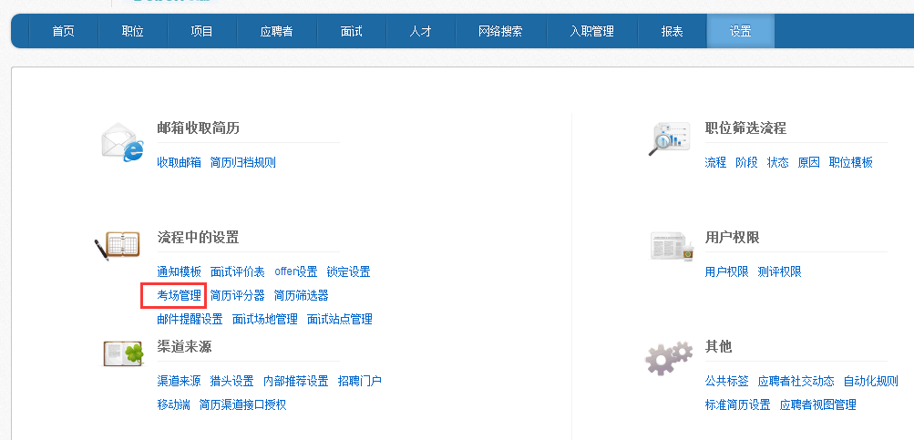
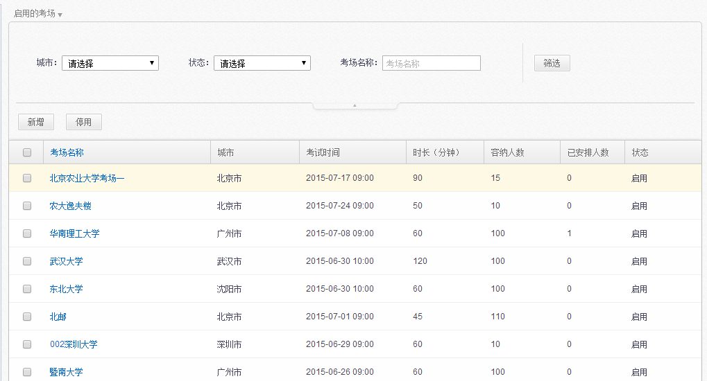
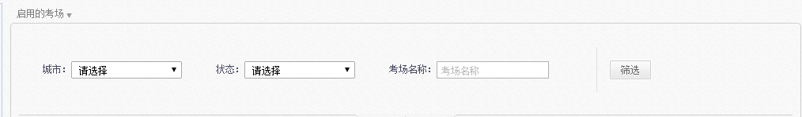
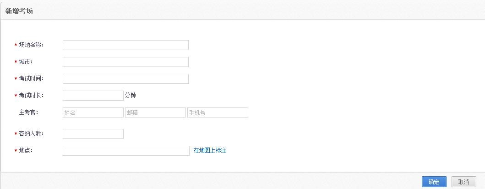
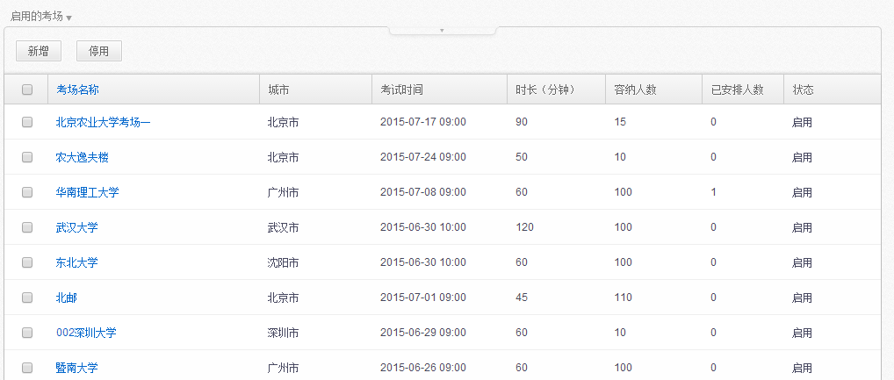
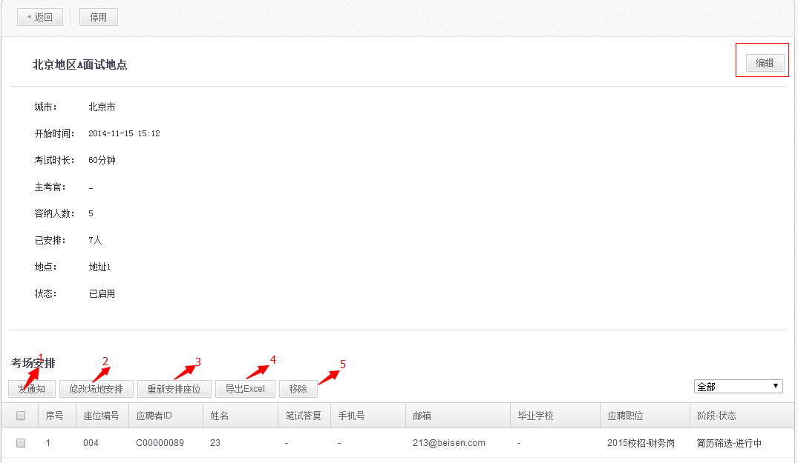
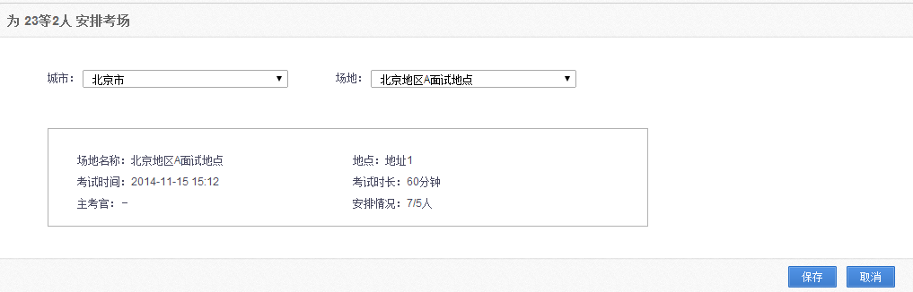
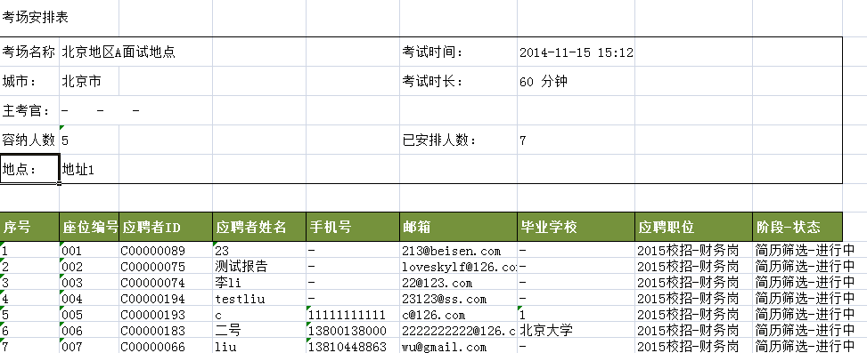

# 9.3.5 考场管理

点击“设置”中的“考场管理”模块。

进入“考场管理”页面。

可以按照城市、考场状态、考场名称进行筛选。

点击下面的【新增】按钮，进入“新增考场”页面。

1、场地名称：可以自行定义考场名称，以后期方便辨识为宜。

2、城市：系统会弹出全国城市列表，包括香港、台湾、澳门，还有海外的一些城市。

3、考试时间：输入考试开始日期和时间。

4、考试时长：输入考试时长。

5、主考官：是非必填项。

6、容纳人数：写明考场容纳人数，方便后期选择考场。

7、地点：最好输入考场的具体地点，并在地图上标注，后期给应聘者发考场通知时，应聘者可以查看地图，了解考场的具体地点。

点击【确定】，可以完成考场的建立。建立好的考场会体现在“考场列表”中，如下：

如果要对已经建好的考场进行编辑，则只需要点开“考场名称”，进入如下页面：

点击【编辑】，可以对考场的具体内容进行编辑。

1、发通知：请参看“应聘者”模块下的发通知功能。可以给应聘者发送通知。

2、修改场地安排：勾选应聘者，点击“修改场地安排”，进入如下页面，可以对应聘者的考场进行修改。

3、重新安排座位：如果考场内的应聘者变动后，比如移除了一些应聘者，或者是将某些应聘者修改了考场，这个时候需要对应聘者重新进行安排座位，可以点击此按钮，系统会按照顺序重新排序。

4、导出Excel：可以将本考场的考生的安排情况用Excel的格式进行导出，如下：

5、移除：可以将考生从本考场中移除，勾选考生，然后点击“移除”即可。
