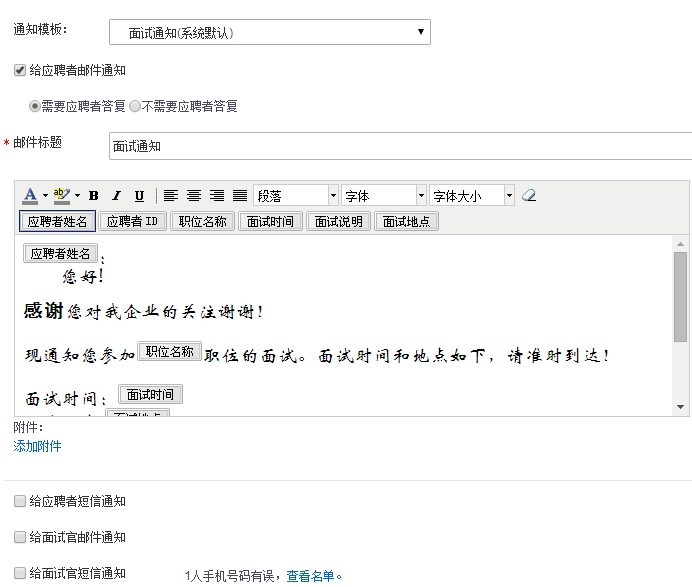

# 9.3.9 面试场地管理

点击“设置”中的“面试场地管理”模块。

进入“面试场地管理”页面。

可以按照面试场地的城市、状态、场地名称来进行筛选。

点击下面的【新增】按钮，进入“新增面试场地”页面。

1、场地名称：可以自行定义面试场地名称，以后期方便辨识为宜。

2、城市：系统会弹出全国城市列表，包括香港、台湾、澳门，还有海外的一些城市。

3、面试地点：最好输入面试场地的具体地点，并在地图上标注，后期给应聘者发面试场地通知时，应聘者可以查看地图，了解面试场地的具体地点。

4、面试官：非必填项，可以添加多名面试官。后期发通知时，可以同时给面试官发送邮件和短信通知。

5、面试类型：选择相应的面试类型。

6、面试主题：主要是面试官在邮件中查看。

7、面试评价表：选择预置好的面试评价表。

8、开始时间：标记第一轮面试的开始时间。

9、面试时长：输入面试时长，以便后期系统协助根据时长来安排面试。

10、休息时间：可以添加休息时间，系统安排面试时会错开休息时间，安排更智能。

11、面试形式：勾选多名应聘者时，系统会提示选择个人面试或者集体面试，按照实际情况进行勾选即可，同时可以设置分组。

点击【确定】，可以完成面试场地的建立。建立好的面试场地会体现在“面试场地管理列表”中，如下：

如果要对已经建好的面试场地进行编辑，则只需要点开“场地名称”，进入如下页面：

1、	点击【编辑】按钮，可以对已经设置好的面试场地进行编辑。

2、点击“查看具体安排”按钮，可以查看当前的安排情况，同时还可以点击“编辑”进行场次的更改，还可以手动添加新场次。

3、发通知：点击“发通知”功能，给应聘者和面试官发“面试通知”。可以同时发送邮件和短信通知。

4、修改安排：点击此按钮，可以对应聘者的面试场地安排进行修改。

5、移除：将应聘者从此面试场地安排中移除。

6、导出面试安排：可以选择字段，进行导出，格式为：excel格式。

7、面试答复：应聘者的答复可以自动调取，会分为：未答复、参加、不参加三种类型。

8、面试结果：面试官对应聘者的评价也可以自动调取，分为：通过、淘汰、待定三种类型。
