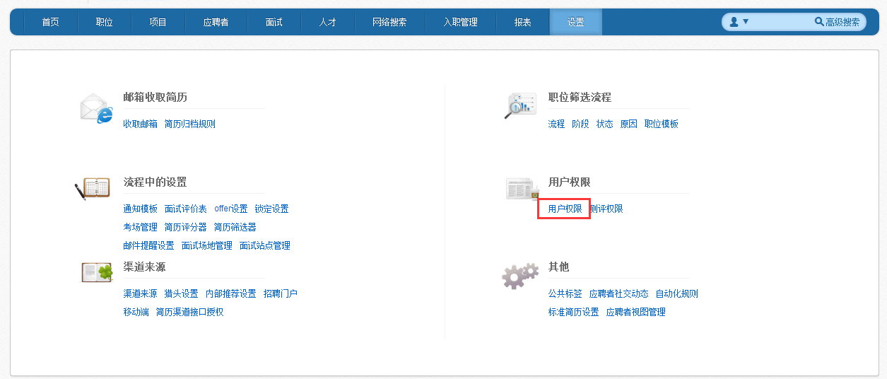
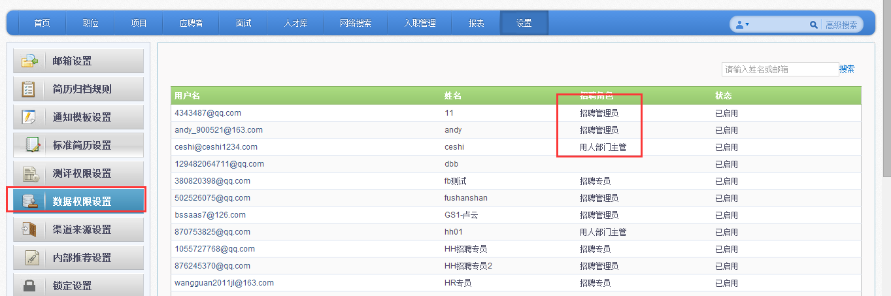
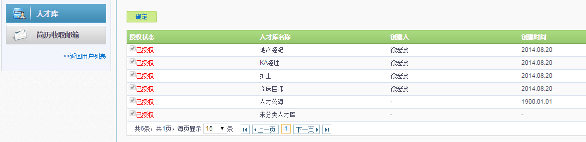

# 9.4.1 数据权限

进入招聘系统的“设置”模块，点击“数据权限设置”导航，查看各用户的招聘角色。“招聘管理员”角色：系统默认管理员拥有最高权限，可查看并操作所有的职位/储备库/收取简历的邮箱。 

“招聘专员”、“用人部门主管”角色：点击招聘专员的用户名，进入招聘职位/储备库/简历收取邮箱的授权界面。管理员可授权专员可查看/管理哪一个招聘职位。 在“授权状态”下打”√”，则该储备库向此招聘专员开放了查看及管理权限。 

