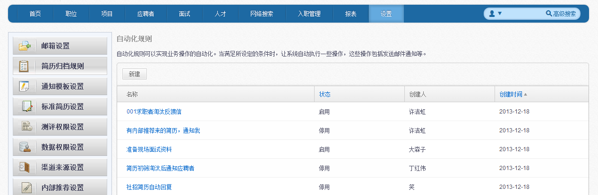
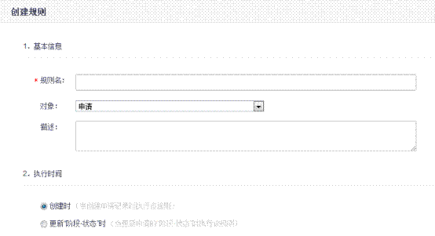
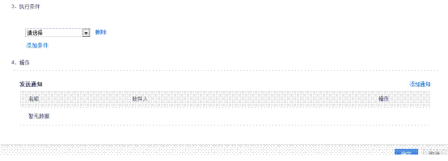
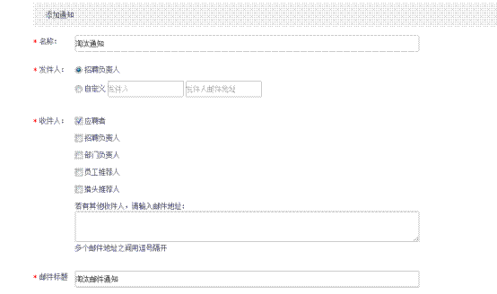

# 9.5.3 自动化规则

在“设置”中点击“其他”中的“自动化规则”可以弹出以下页面。自动化规则可以实现业务操作的自动化。当满足所设定的条件时，让系统自动执行一些操作，这些操作包括发送邮件通知等。

点击【新建】，弹出以下页面。 

1、 设置基本信息，填写规则名。 

2、 设置执行时间。 

 

3、 设置执行条件：可以设置多条执行条件。 

4、 选择操作:可以添加通知模板。 

