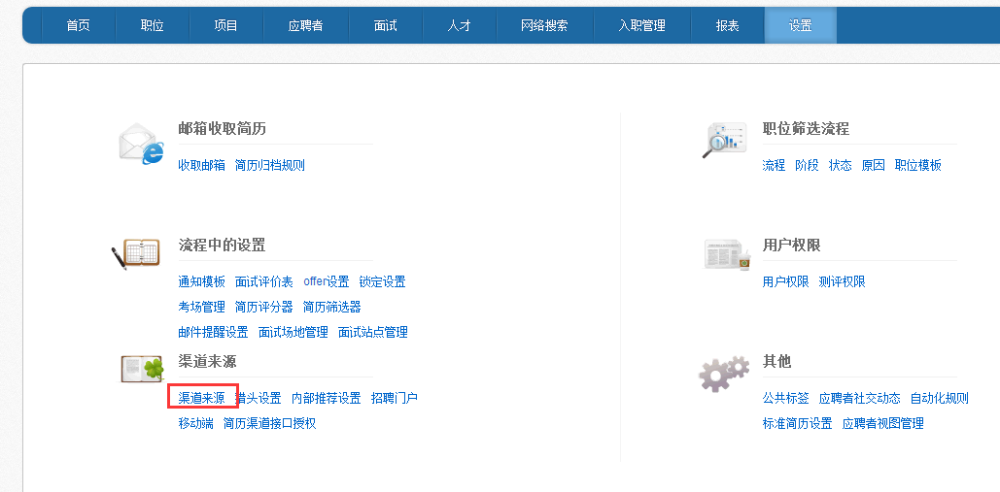
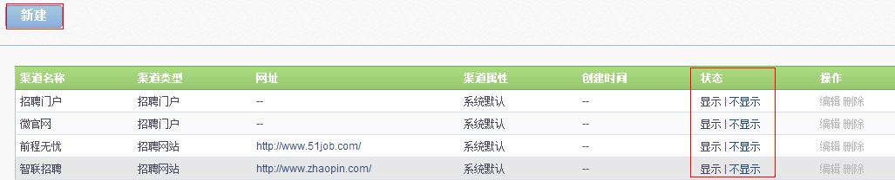
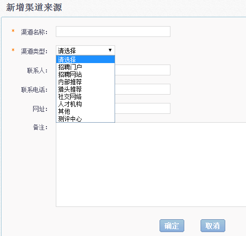

# 9.6.1 渠道来源

点击“设置“中的”渠道来源“按钮。

进入“渠道来源“列表，列表中包含系统自带的渠道来源与客户自行建立的渠道来源。

状态中的“显示、不显示“可以设置渠道来源在前期选择时是否显示出来。

点击【新建】，进入新增渠道来源页面。

1、渠道名称：可以自行定义，以方便后期区分为宜。

2、渠道类型：系统默认弹出几种渠道大类，可以进行选择。

3、联系人、联系电话、网址、备注：非必填项，可根据实际情况选择填写。

点击【确定】即可新建渠道成功。