# 9.6.2 猎头推荐表

点击“设置“中的”猎头设置“。

 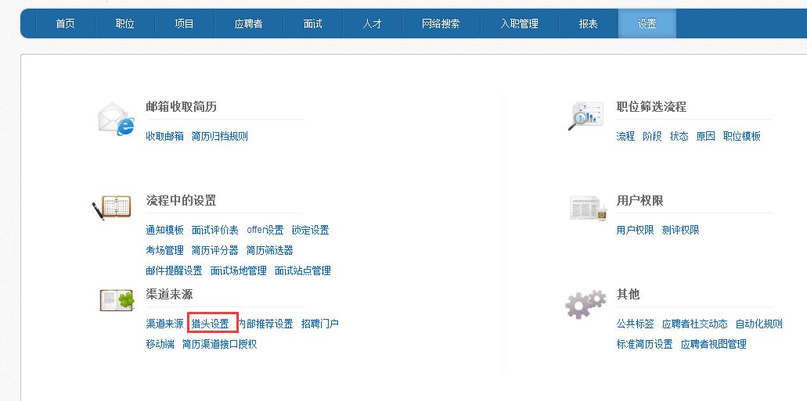

1、点击【新增】按钮，可以配置猎头公司。

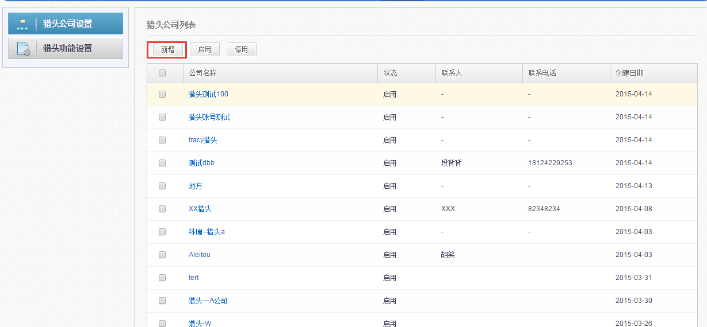

输入猎头公司详细信息，点击确定。

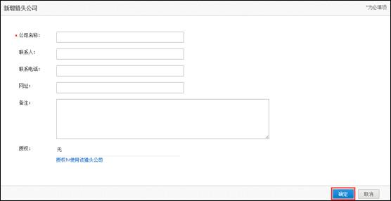

2、点击已创建好的猎头公司，进行猎头账号配置。

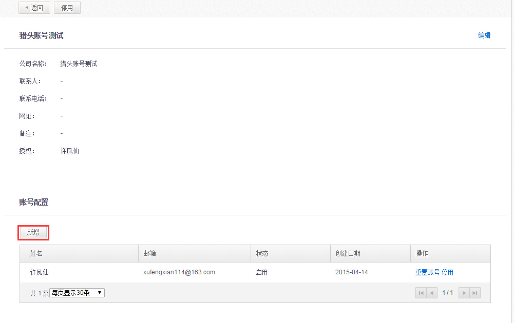

自定义猎头用户名，输入猎头邮箱，点击确定，系统会自动发送用户名和随机生成的密码至邮箱。

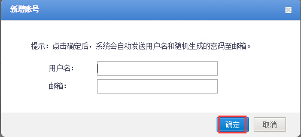

3、猎头功能设置，点击编辑，可对猎头推荐权限及猎头推荐表进行设置。

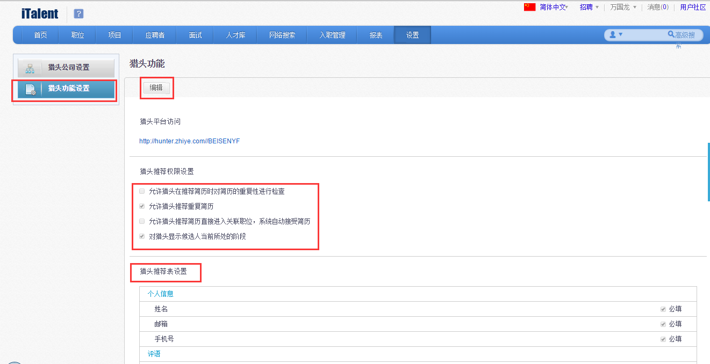

4、猎头设置－公司设置列表，增加筛选区，可按公司名称搜索－便于客户快速寻找猎头公司,按公司状态搜索，帮助客户形成启用中猎头公司的视图

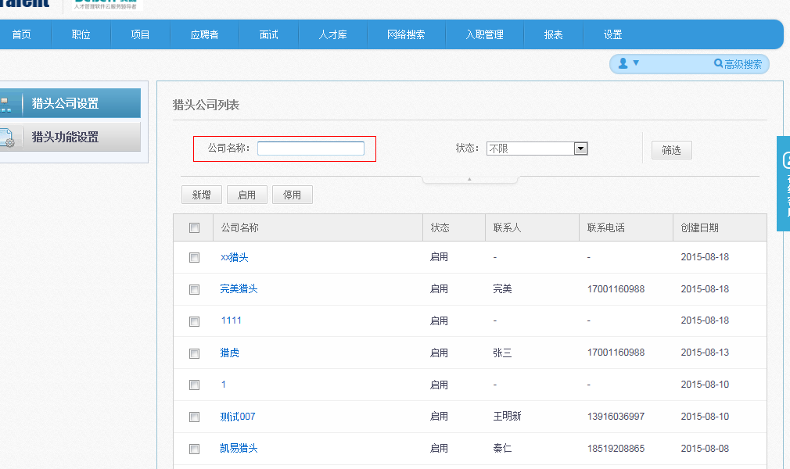

5、猎头公司电话不再限定大陆，港澳台、国外电话也可输入

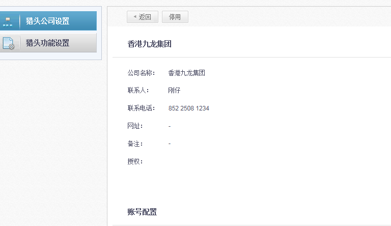

6、配置猎头账号时，原有用户名、邮箱两项，且在系统中均不可重复使用；改造之后，配置账号，有“姓名、邮箱”两项，仅对邮箱进行唯一性限制，姓名可重复

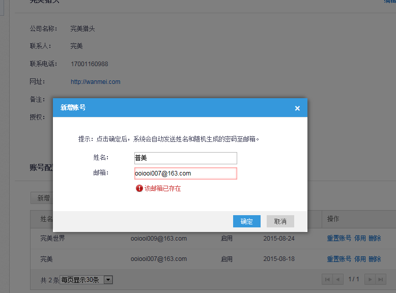

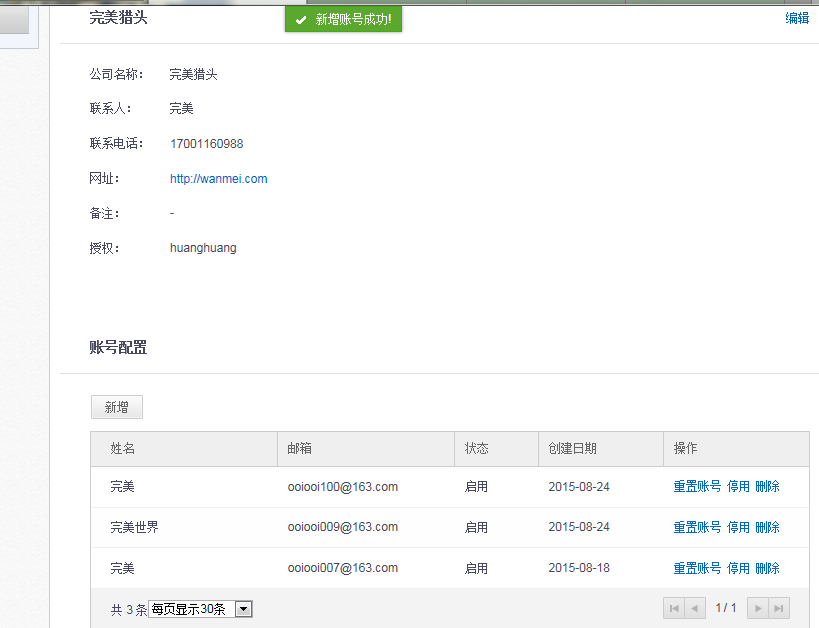

7、猎头账号增加删除功能：若账号下没有数据，即该账号未推荐过候选人时，可删除；若账号下有数据，则提示不可删除。

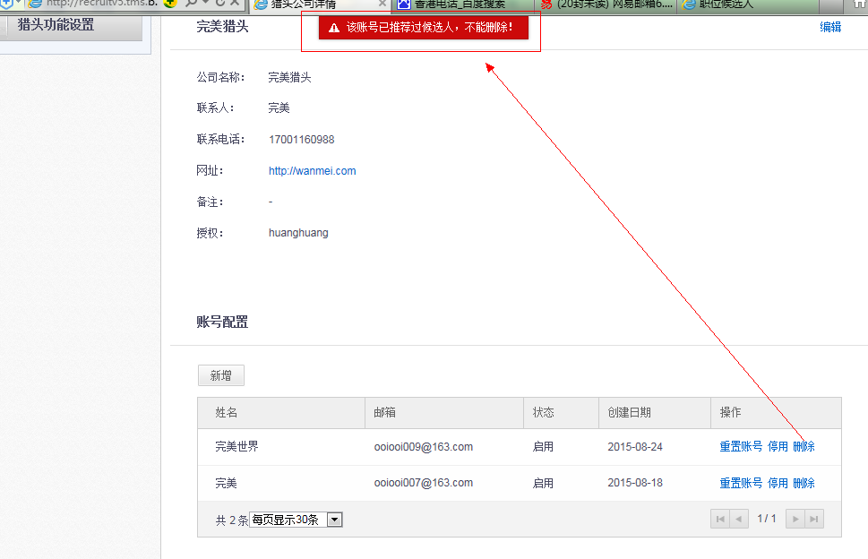

8、猎头简历不仅与已入库的简历查重，也与未入库（即猎头推荐列表里尚未处理）的简历查重（前提是猎头推荐的简历提供了邮箱与手机号码），否则将进行简历相似度查询。

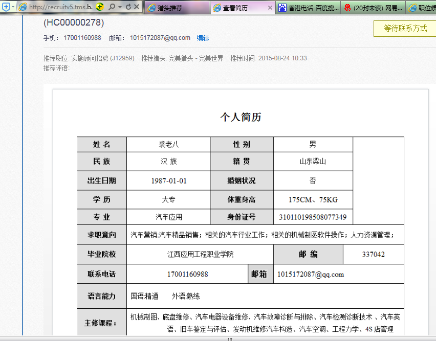

9、hr可选择允许猎头在简历推荐时允许对简历的重复性检查、允许推荐重复简历、允许猎头推荐简历直接进入关联职位、对猎头显示候选人当前所处阶段，具体如下：

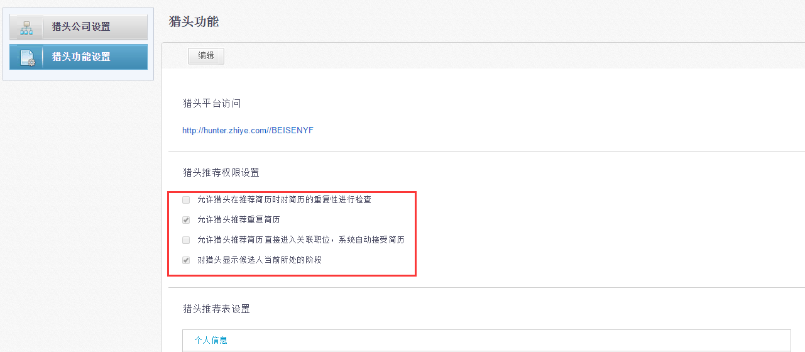

10、控件更换，既可以选择猎头公司，又可以选择猎头顾问；可单选，可多选；可搜索

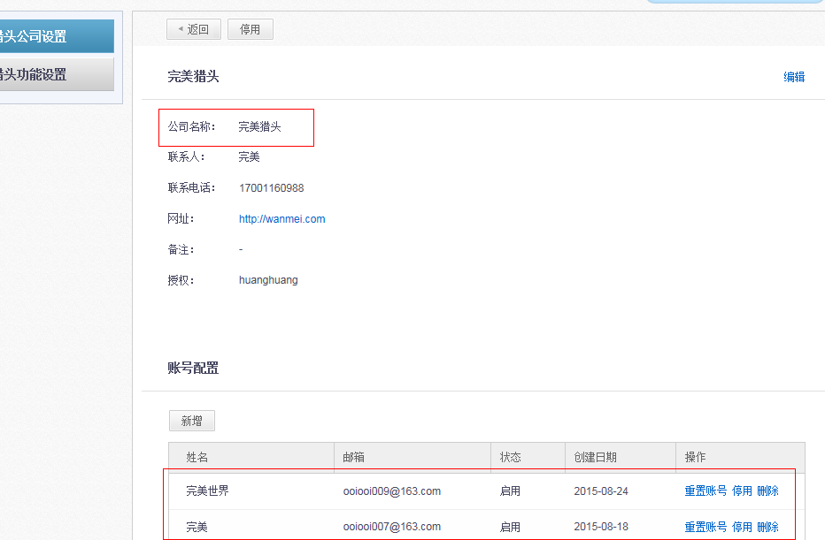

