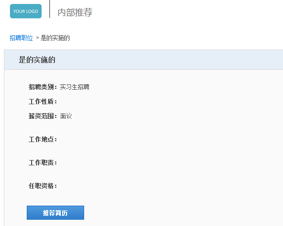

# 9.6.3 内部推荐设置

点击“设置“中的”内部推荐设置“按钮。

进入“内部推荐设置“模块：

#### 9.6.3.1 悬赏管理

（1）	通过查询关键字（推荐人、悬赏类型）可以检索出推荐人的悬赏记录（奖金或积分），并且可以将推荐人的悬赏记录导出到Excel中，便于数据统计或者奖金的发放使用，如下图：

（2）	可以在悬赏记录的列表区域可以显示出来推荐人的姓名、邮箱信息，同时可以通过点击被推荐人的姓名可以查看详细简历信息，如下图：

 

#### 9.6.3.2 内推设置

点击【编辑】按钮，可以进入编辑详情”，可编辑公告，BANNER等内容

（1）	点击“内部推荐专区网址”可以直接进入内部推荐页面：

输入内部推荐员工访问密码，点击验证，可以进入内推页面：

点击正在招聘的职位，可以推荐简历：

点击【推荐简历】：

（2）内部推荐员工访问密码：是4位的数字，可以自行设置。

（3）如果在招聘门户设置内部推荐专区入口的话，则在招聘门户上会看到这样的标识：

（4）内部推荐公告设置功能：点击编辑按钮，可以输入内部推荐公告内容，不超过5000字即可。

#### 9.6.3.3 推荐设置

推荐人信息设置：可以按照电脑端与手机端分别配置内部推荐时所填写的字段以及可以设置推荐人信息是否可以必填，如下图：

 
2.10.6.3.4 奖励规则

设定内推的奖励规则，注重过程中的奖励，使用此功能。

点击【新增】后，如下图设定具体的奖励规则：

点击【新增悬赏项】

可设定，当内部推荐的人进入到某个流程的某个阶段后给多少奖励，如：应聘者到了一面给200元奖励，到了最终的正式录用给2000元奖励等等。

#### 9.6.3.5 内推悬赏

可以设置内推的全局设置，如转发次数多少次以后奖励多少金额或积分等等。

点击右上角的【编辑】即可变为如下图：

 
