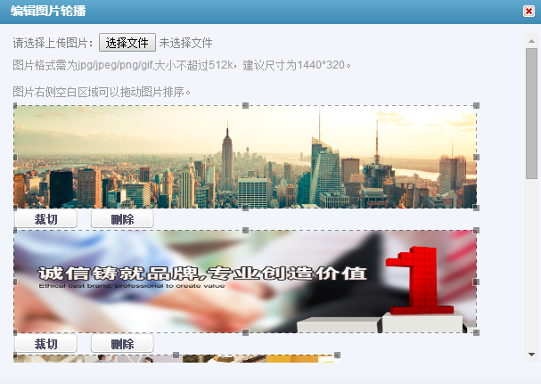
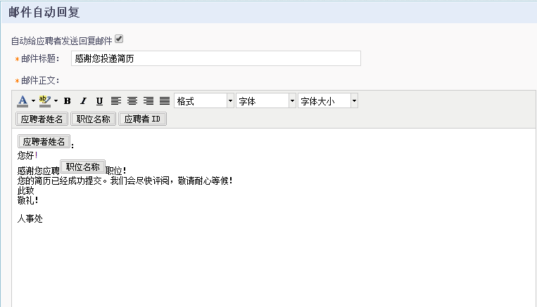

# 9.6.4 招聘门户

点击“设置”中的“招聘门户”模块。

进入“招聘门户”页面。

#### 9.6.4.1 招聘门户设置

点击“招聘门户设置”，进入门户配置详情页面。

在此页面，可以针对招聘门户上的各个页面进行编辑，点击蓝色的编辑栏即可。

##### 9.6.4.1.1 编辑logo

点击 ，如下图所示，可上传logo，图片格式需为jpg/jpeg/png/gif,大小不超过512k，建议尺寸高为60px 。

##### 9.6.4.1.2 编辑页签

点击 ，如下图所示，可编辑页签的属性。 

点击 即将该页签设置为主页；

点击 将页签设置为显示或隐藏；

点击 编辑页签名称, ；

点击 为页签添加链接， ，勾选“在新页面打开”即链接的网址将在新的页面打开；

点击 删除该页签。

点击 可添加新页签， 。

将页签的属性编辑好后，可在网申门户主页上点击相应页签编辑每个页签下的内容。如“联系我们”，点击 ，如下图显示可编辑公司或招聘部门的联系方式。

##### 9.6.4.1.3 编辑轮播图片

点击 ，如下图所示，可插入、编辑、删除图片。如图显示，图片格式需为jpg/jpeg/png/gif，大小不超过512k，建议尺寸为1440*320。图片右侧空白区域可以拖动图片排序。 

##### 9.6.4.1.4 设置搜索

点击 ，如下图所示，可设置职位的搜索方式和搜索字段。

##### 9.6.4.1.5 设置显示分类

点击 ，如下图所示，选择显示的职位分类。 

9.6.4.1.6 设置招聘动态

点击 ，如下图所示， 可设置招聘动态的显示条数。招聘动态的内容设置见下“招聘动态管理”。

##### 9.6.4.1.7 编辑自定义图片

点击 ，如下图所示，可插入企业的宣传图片或添加企业官网主页等链接。 

#### 9.6.4.2 申请及简历设置

点击“申请及简历设置”，进入配置页面：

1）**网申个人简历**：

点击【编辑】按钮，可以编辑“网申个人简历”模板。此模板对应应聘者在招聘门户上的个人中心简历模板。

点击【预览】按钮，可以预览模板效果。

2）**新增申请表**：

点击【新增申请表】按钮：

输入“申请表名称”，也可以编辑“申请表描述”，点击【下一步】：

点击“1选择模块”，可以选择申请表模板的大项。

点击“2选择模块”，可以选择申请表模板每个大项下的小项。

3）**附加问题模块**。

点击【附加问题按钮】，可以编辑附加问题。

点击【新增问题】：

可以选择“问答题“、”单选题“和”多选题“。

注：问答题可以输入4000字符的答案。

#### 9.6.4.3 职位分类设置

点击“职位分类设置“，

1、点击【编辑】，可以编辑职位分类一的子类。

2、点击【编辑】，可以编辑职位分类二的子类。

#### 9.6.4.4 招聘动态管理

点击“招聘动态管理“按钮，

点击【新增动态】按钮，

1、填写“动态标题“：动态标题可以显示在招聘门户前台页面，所以标题一般要正式且突出重点。

2、填写“动态分类“：可以选择”社会招聘“、”校园招聘和“实习生招聘”。

3、编写“动态内容“：可以输入文本10000字以内。不能插入图片，但是可以上传附件。

4、动态职位：可以选择职位动态的启用和停用。

#### 9.6.4.5 职位广告管理

点击“职位广告管理“按钮，如下图，可以在此批量发布、停用和刷新职位。

1、停用：针对之前已经在招聘门户上发布的广告进行停用，可以单个停用也可以批量停用。

2、发布：针对之前已经在招聘门户上停用的广告进行发布，可以单个发布也可以批量发布。

3、刷新：可以单个或者批量对职位广告进行刷新，刷新后的职位会排名靠前。

#### 9.6.4.6 其他设置

点击“其他设置“，先进入”申请职位许可“模块。

1、可以设置应聘者半年内最多允许申请几个职位，可以输入1-100之间的整数。

2、可以设置是否允许重复申请同一个职位。

3、使用招聘志愿：如果勾选此项，则应聘者投递多个职位时，可以在北森系统后台，筛选简历的位置，显示第一志愿、第二志愿、第三志愿或者其他志愿，方便HR在系统中进行筛选。

4、简历附件展现为原始简历：如果勾选此项，应聘者在招聘门户上投递简历时，如果上传了简历附件，则北森系统中将会把此附件解析为应聘者的原始简历。

##### 9.6.4.6.1 进入“邮件自动回复“模块

 
如果勾选此项，当应聘者在招聘门户上投递简历时，系统自动回复此邮件模板。

##### 9.6.4.6.2 进入“应聘者投递设置”模块

1、	注册服务条款：应聘者在招聘门户上进行注册时，看到的界面如下：

点击“服务条款“，可以查看具体条款内容，勾选上此条款时，方能继续进行注册。

2、应聘者声明：

应聘者在招聘门户上投递简历时，在提交简历之前，需要勾选上此声明，方能将简历进行提交。

##### 9.6.4.6.3 进入流程勾选设置模块

1、流程选项：

允许应聘者导入简历：导入简历可以帮助应聘者自动填写一些申请信息，为应聘者节省些工作量，系统会自动匹配导入的简历和申请表字段。

显示申请状态：应聘者在招聘门户个人中心上，可以查看自己的申请所在的处理状态。

投递后直接可以进入自动邀请测评：此功能只是对自动邀请测评的职位有效。

2、投递到人才库设置：

勾选上此项之后，在招聘门户上显示如下：应聘者如果没有找到合适的职位，可以先将简历投递到企业的人才库下。

3、身份证号验证设置：

通过对身份证号的查重，避免同一个应聘者变换身份多次投递同一个职位的情况发生。

4、撤销申请和编辑申请设置：

当应聘者的简历未被处理时，允许应聘者对简历进行编辑和撤销操作。

