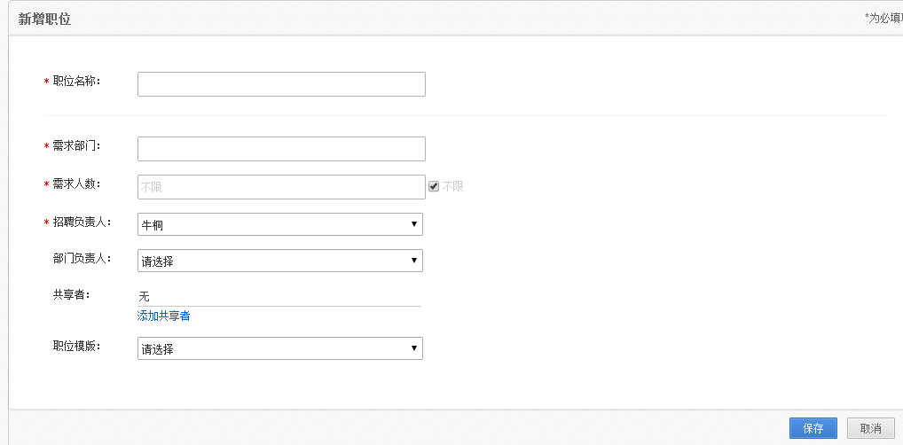

# 2.3.1 第一步 新增职位

打开新建职位页面，如下图：

录入相关信息后，点击【保存】即可。

此处文字说明：

需求部门：为系统管理员在系统设置（非招聘系统设置）功能下，设定的组织机构，如需改变请联系企业管理员。

需求人数：默认不限

招聘负责人：默认当前系统登录人，可手工选择其他人员（招聘管理员），选择后此职位归此负责人处理。
部门负责人：默认为空，选择系统内的负责人，可以是部门主管或经理，登陆系统后可以对该职位进行处理，如：筛选简历，安排面试等。

共享着：通过共享给其他招聘人员，对该职位的应聘者进行处理。系统默认职位只能由建立人进行处理。
职位模板：通过预先建立好的职位模板，可以快速建立该职位。
