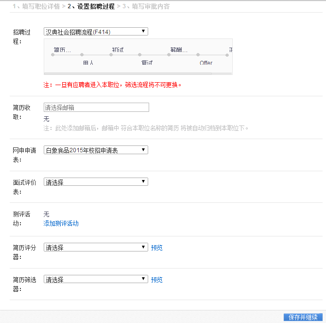
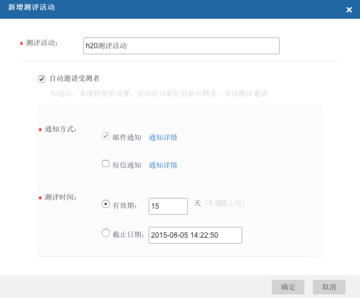

# 2.3.3 第三步 设置招聘过程

招聘过程：选择自己的招聘流程，一般由管理员统一建立。注意一旦有应聘者简历进入到这个职位下，则招聘过程不能修改。

简历收取：此处为系统设置的简历收取邮箱，设定后从该邮箱下对应的职位简历自动进入到该职位下，并生成归档规则为精确匹配。

网申申请表：应聘者前台网申页面投递简历时填写的信息表格。

面试评价表：系统设定好的面试评价表，一个职位可设置多个面试评价表。

测评活动：添加该职位下的测评活动，添加后该职位下的应聘者才可以使用对应的测评。

**注意：测评活动必须在测评模块生成活动后方可以选择，通过勾选自动邀请受测者可以自动对该职位的应聘者发送测评活动，有测评次数限制的客户请谨慎选择。**

简历评分器：由北森根据客户需要制作的简历评分器，可以自动对应聘者简历进行打分。

简历筛选器：由北森根据客户需要制作的简历筛选器，可以根据自定义的筛选条件对应聘者进行简历的自动过滤，不合格的简历自动进入淘汰。

