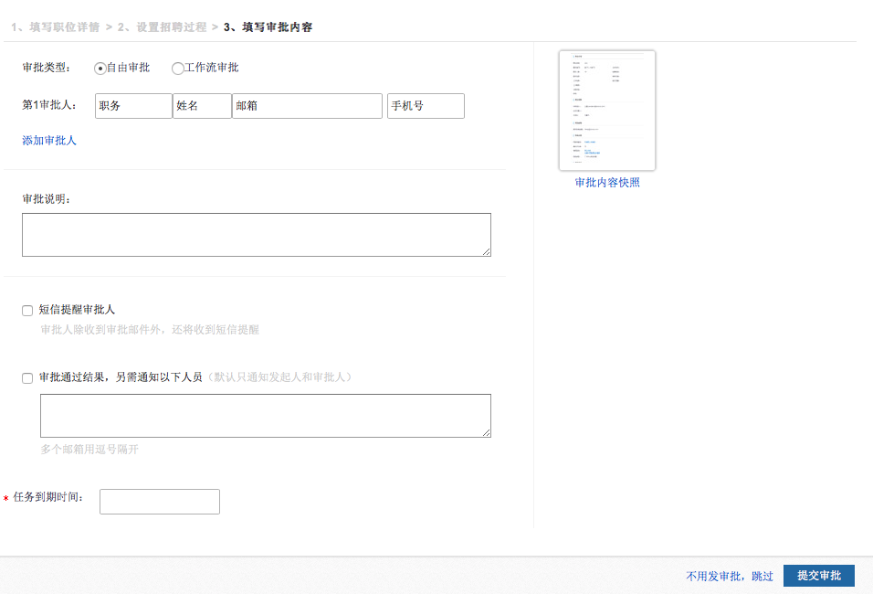

# 2.3.4 第四步 填写审批内容

【保存并继续】后，进入到职位审批页面，如有需要职位审批的客户可以使用，如无需在招聘系统中审批请直接点击“不用发审批，跳过”链接按钮。如下图：

添加审批人：可以添加多个审批人。

审批通过结果，另需通知以下人员：此处填写的是邮箱用逗号隔开。

任务到期时间：必填，填写后如果将到期会给发起人邮件提醒。

此处提交审批后，会在审批人的邮箱里收到审批邮件通过E-link的方式进行审批，审批通过后职位才可以创建成功，审批方式为串行审批。

