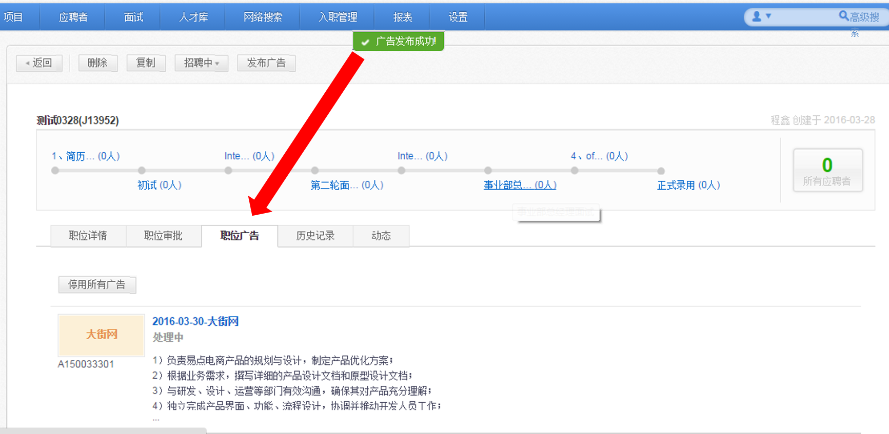
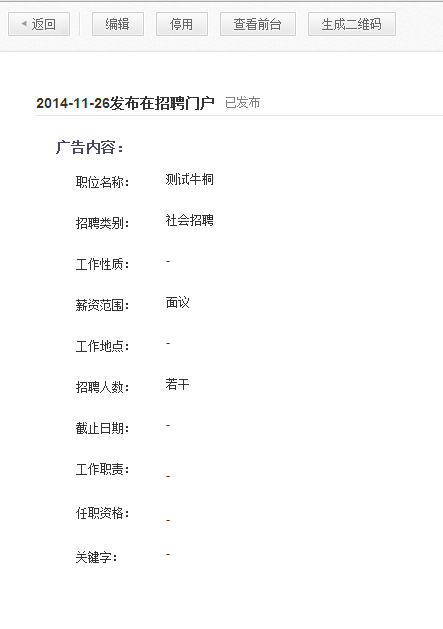
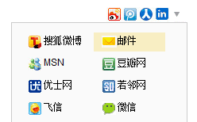

# 2.4.4 第四步 广告发布完成

广告发布成功后显示如下图：

点击广告名称，可以进入到职位广告信息页面如下图：

通过【编辑】，【停用】按钮进行广告的处理，点击【查看前台】，可以查看该职位广告在网申页面（xxx.zhiye.com）的情况，点击【生成二维码】按钮可以生成该职位的二维码。

还可以通过右边的 分享按钮可以分享到各个微博网站上去。

**注意：发布到招聘网站上的职位点击名称进入后可能有所不同**

