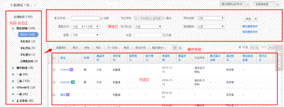
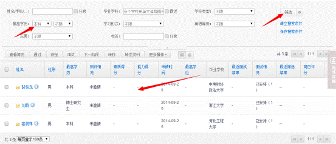

# 2.5.2 第二步 简历初筛

进入到简历处理的页面，如下图：

此处分三个区域：阶段状态区、筛选区、列表区。

阶段：简历初筛，测评筛选、一面……称为阶段。

状态：本轮淘汰，进行中、本轮通过等等。

阶段和状态均是通过招聘管理员在设置的功能设定。详见“**9.2职位筛选流程**”内容。

通过筛选区的条件来进行简历的劣汰，如：我想筛选出所有本科以上的人，在最高学历的地方输入“本科-不限”点击【筛选】，如下图：

筛选出来3个人，全选上选择下一阶段即可，剩下的人淘汰。

同理如果想要筛选出来所有专科以下的，在最高学历选择“不限-大专”，点击【筛选】，查出的所有人统一淘汰也是可以的。

**如果列表区和筛选区的字段不是你想要的可以点击轮按钮进行选择。**

