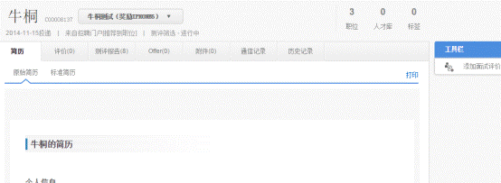

# 2.5.3 第三步 简历筛选

简历可以通过筛选的方式初步筛选劣汰，同样择优时候也可以通过单个查看简历内容进行筛选，操作如下：

### 2.5.3.1 简历处理方式

1、 登陆到系统职位里面筛选并处理

（1）选择单个人的简历，点击简历人名称，弹出如下图：通过右侧的工具栏进行筛选（根据阶段不同工具栏数量会有不同），单个简历查看可以查看多个维度的信息，如：评价、测评报告、OFFER、附件、通信记录、历史记录等信息；并可以看到该应聘者应聘几个职位，分别为哪些职位（根据权限不同看到会有差别）

（2）选择多个简历点击 ，弹出如下图：通过右侧的工具栏进行处理后会自动关闭该用户，从而快速处理。

（3）在列表区选择多个人员后通过上方的处理按钮进行处理，如下图：

2、 通过收到的邮件E-LINK的方式进行查看。

系统操作人通过“转发资料或筛选简历”的方式给处理人发送邮件后，简历处理人会收到一封系统发送的人员邮件信息，打开邮件对里面的人员信息提出处理意见，如下图：

点击‘应聘者详情’后进入到如下页面：可以查看该应聘者的简历信息，并对该简历进行评价，评价后会直接反馈给邮件发送人，方便邮件发送人进行简历的处理。

一般应用于HR给部门业务人员筛选简历，或者HR给其他想看简历的人发送简历使用。下面会有详细的介绍。

**注意：第二种方式只能是对简历给出筛选意见，是不能对简历进行直接操作的。**

### 2.5.3.2 简历处理按钮介绍

通过：该按钮存在于有本轮通过状态存在的流程阶段当中，点击后应聘者进入到本轮通过状态。

淘汰：点击后，进入到本轮淘汰状态下，根据设置可能要求填写淘汰原因。

下一阶段：点击后，转移到下一个阶段，如：初试，进入到复试阶段。

转移：通过【转移】按钮，可以快速将应聘者转移到其他阶段和状态下，一般用于淘汰状态的人员从淘汰状态中转移其他状态中或者跳过某个阶段进行下个阶段使用。

转发资料：可以通过转发资料，发给非系统内的人员对该应聘者进行查看和评价。

筛选简历：同转发资料，除发给非系统内的人员对应聘者进行查看和评价外，还可以对应聘者进行通过淘汰的建议，反馈在系统中。

更多操作：点击后看到其他操作按钮。

发通知：通过邮件、短信的方式发送通知信息给应聘者。

安排面试：给应聘者和面试官安排面试地点，时间等，通过邮件、短信的方式通知应聘者及面试官，邀请多个人员时，可以自动安排人员时间，但是对人员的变动处理起来比较麻烦。

安排至面试场地：通过设置好的面试场地，可以将人员安排进面试场地里面去，如果有人员变动可以随时调整，但必须先在系统内建立面试场地，一般适用于校招人员安排较多的情况。

邀请测评：通过邀请测评可以对该阶段选择的应聘者进行系统的测评服务，通过测评成绩辅助HR进行简历的筛选。

OFFER审批：发送OFFER前的审批工作。

发OFFER：发送OFFER

邀请更新简历：通过发送邮件或短信的方式，邀请应聘者更新简历，一般出现在人才库功能内。

安排考场：通过系统提前设置好的考场内容，对应聘者进行考场安排。

添加备注：通过手工填加备注的方式，对应聘者添加备注，字数不超过1000字。

锁定：设定好锁定时间后，当前操作人可以锁定某个应聘者，此时其他操作人不可对该应聘者进行操作，锁定时间及数量均可以设定。

关注：给应聘者添加关注后，应聘者姓名后会出现标示 ，此时如果其他操作人对该应聘者进行操作，系统会给添加关注的操作人发送提醒。

打标签：通过预先设置好的标签内容，对应聘者进行标签操作，方便快速查询筛选。

推荐到职位：通过该按钮可以将应聘者推荐到其他职位下，可以按职位或者部门进行筛选。注意：本职位下应聘者还存在。

储备到人才库：通过点击该按钮可以将应聘者储备到对应的人才库。

添加至入职管理：进入到正式录用阶段后，可以向应聘者通过该按钮添加到入职管理里面，通过手机APP入职帮帮的功能，发送一些企业相关入职信息。

列入黑名单：将选择好的应聘者放到黑名单中，应聘者无论投递多少职位，全部会列入到黑名单里面去。

删除：删除该应聘者，注意此按钮一旦点击，全系统共享，删除后整个系统内此应聘者全部删除。

导出数据：选择相应的应聘者，选择相应的导出字段，将选择后的应聘者信息，生成EXCEL或
WORD文档； 同时可以将导出模板保存下来，以便下次继续使用； 

导出所有数据：导出全部应聘者的信息。

导出文档：导出HTML格式的原始简历。

调整简历评分：通过该功能调整该简历的评分，便于筛选。

导入成绩：系统支持导入3个成绩方便筛选，用过EXCEL的方式导入。

打印简历：生成PDF格式的原始简历，方便打印。

打印全部简历：生成所有应聘者PDF格式的原始简历。

### 2.5.3.3 部分按钮具体操作介绍

下面介绍部分按钮的具体操作和界面，邀请测评及安排面试和OFFER等按钮在后面具体流程中介绍。

注意对应聘者的操作，建议全部在对应职位阶段下操作。

#### 2.5.3.3.1 按阶段流程管理应聘者

点击“简历初筛--进行中”，显示所有处于进行中的简历，进行简历初筛。
 

通过初筛：通过初筛的人员，勾选后，点击下一阶段，将其放入下一阶段（如简历复筛/测评/面试）

淘汰应聘者：同样选中相应人员后，点击【淘汰】，被淘汰的应聘者会进入‘本轮淘汰’状态。
 

#### 2.5.3.3.2 快速查看简历

从初筛到测评/面试、拟录用阶段，可选择一个、多个或全部招聘者，点击“查看简历”按钮，即可一次同时查看多人简历。
 

在快速查看简历页面下，可以一次看到多位应聘者的简历快照。点击右上方“箭头”可以进行页签前后滚动。右侧工具栏可以对应聘者进行通过、淘汰、推荐到职位、储备到、彻底删除及列入黑名单操作等。

应聘者名字后的数字，代表此应聘者投递了几个职位，如显示N，则代表投递了10个以上（含10个）的职位。应聘者名字后的‘内’代表来源于内部推荐，‘猎’代表来源于猎头推荐。

