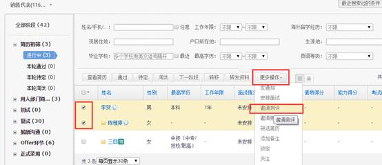
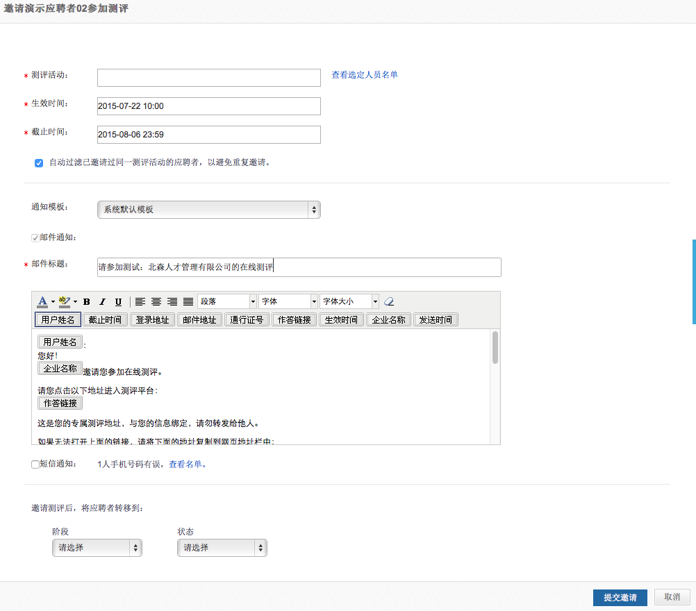
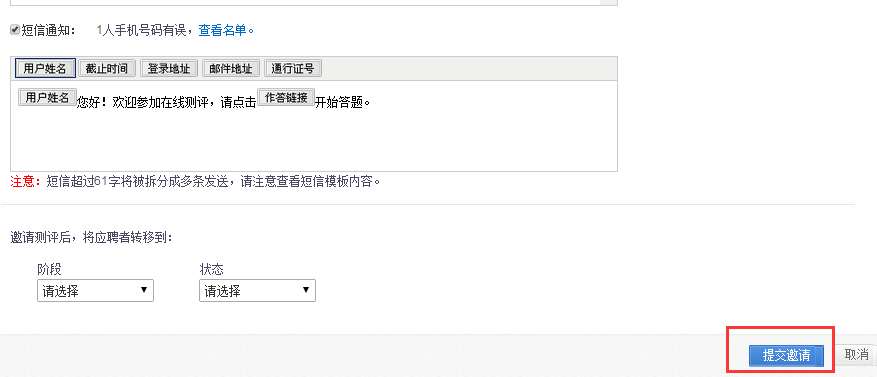
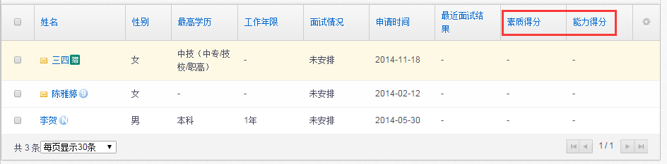

# 2.6 邀请测评

在某职位的“测评”阶段勾选应聘者，点击更多操作中的“邀请测评”按钮

注：设置阶段时，需要在此阶段设置使用“邀请测评”按钮，具体操作见设置手册中“**9.2.3阶段**”

在弹出窗口中，选择要安排的测评活动、设置有效期，编辑邮件通知内容或短信通知内容

自动过滤勾选后，将不会向已做过相同测评的受测者发送邀请。

注：如测评活动已在创建招聘职位时设置完毕，直接选择即可。

选择完测评活动，编辑好邮件及短信通知后，点击【提交申请】即可：

应聘者完成测评后，在应聘者列表可以查看到相应测评的得分，如做过多个测评，显示最新一次的得分。

 
