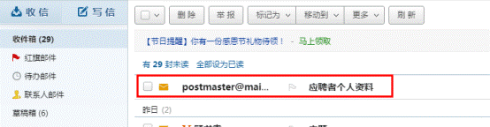
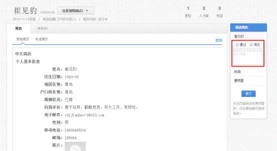
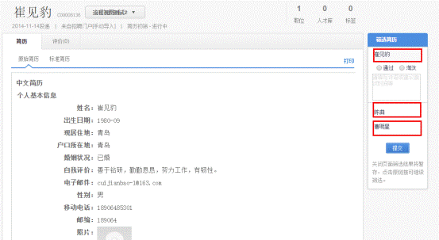
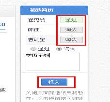
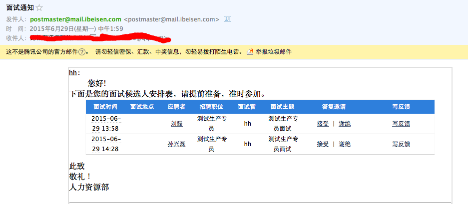
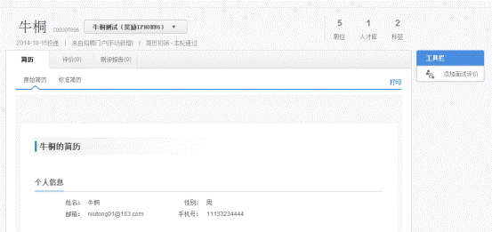
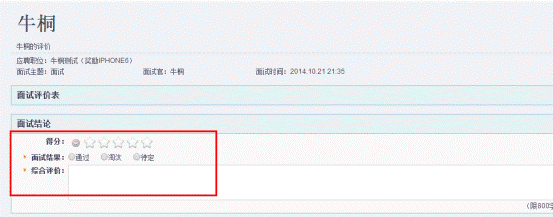

# 2.7.4 面试官操作

简历筛选：HR通过转发资料或筛选简历方式发给面试官进行简历筛选。

面试通知：HR通过安排面试发送面试通知给面试官进行面试人员查看。

#### 2.7.4.1 简历筛选

1、用人部门负责人收到简历筛选邮件，如下图：

2、点击邮件内容：可以看到该应聘者的详细信息。

3、点击应聘者详情可以查看简历信息，多个应聘者会在右侧依次显示，如下图。

4、针对每个应聘者的简历详情筛选，点击通过/淘汰，填写评语等备注信息即可，如下图：

5、所有应聘者筛选完成后，最后点击提交：

#### 2.7.4.2 面试通知

1、面试官收到面试邀请邮件，如下图

 
2、 点击邮件内容：可以看到该应聘者的面试时间、地点、主题和职位。

 
3、 点击应聘者姓名可以查看简历信息，点击答复邀请可以反馈给HR是否参加面试。
 

4、点击面试评价即可评价
 

