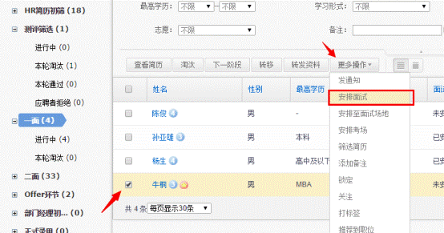
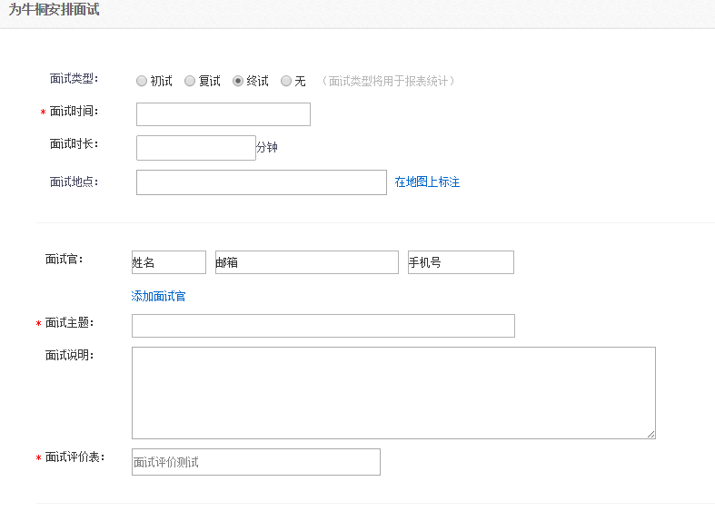
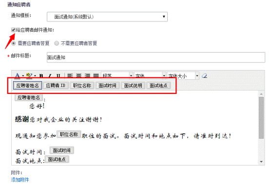
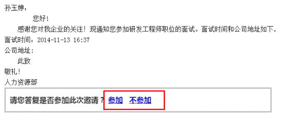
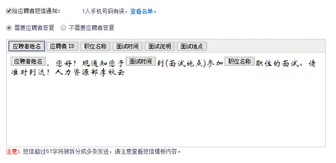
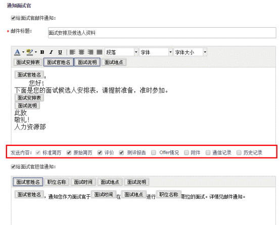
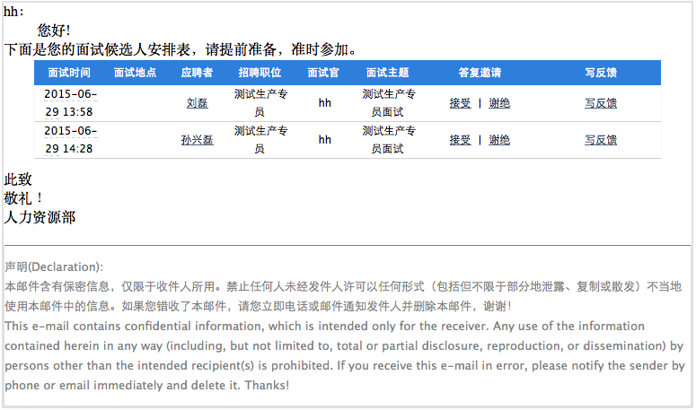
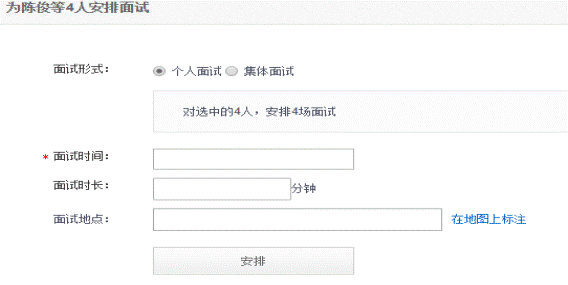
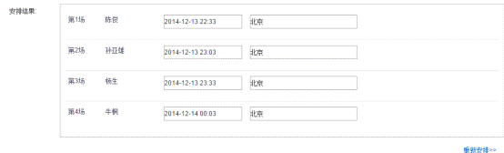
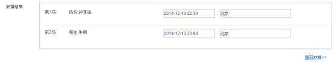

# 2.7 安排面试

通过安排面试功能按钮，可以对通过前期筛选阶段的应聘者发送面试的邀请通知，通过短信或者邮件的方式。

安排面试

选择应聘者后，按顺序点击【更多操作】【安排面试】，如下图：

跳转到如下页面：初试、复试、终试要根据实际阶段选择。

 
填写相关面试信息后，选择对应的面试模板，勾选‘给应聘者邮件通知’如下图：
 

此时将给应聘者发送邮件通知，默认点选‘需要应聘者答复’，上图红框内为自动抓取字段无需编辑直接在下方模板中编辑调用，调用方式为鼠标点击即可；应聘者收到邮件后，可以在邮件中选择参加或不参加，将反馈到系统当中。如下图：
 

勾选‘给应聘者短信通知’如下图：

同样也默认点选‘需要应聘者答复’，不在描述。此处注意尽量不要超过48个字，字数过多会占用多条短信，造成不必要的短信浪费。

如果有安排面试官的话，可以勾选给‘给面试官邮件通知’和‘给面试官短信通知’如下图：红色框体部分为希望给面试官看到该应聘者的哪些信息。

此时面试官收到如下邮件：

通过点击该应聘者的姓名可以看到该应聘者的简历及其他测评等信息。同样通过答复邀请后，可以反映在系统当中。

安排完毕后，点击【确定】即可成功安排面试。

当我们多人同时邀请面试时候，其他操作基本相同，面试安排部分会有些许不同如下图：

个人面试：应聘者一个一个面试。

集体面试：多个应聘者分在一个组，一起进行面试。

此时填写好面试时长后，点击【安排】按钮，会按照时长自动排列应聘者面试的时间：

如下图为个人面试：面试时长为30分钟，面试地点为北京，则系统会自动分配每个人的面试时间。
 

 
如下图为集体面试：面试时长为30分钟，分2组，面试地点为北京，则系统会根据分组分配面试时间。

另：简历模板可以通过设置来提前设定好，详见‘**2.9.3.1通知模板**’
