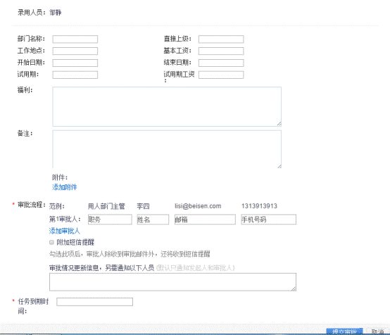

# 2.8.1 OFFER审批

**首先要把面试通过的人，转移到“OFFER环节”这个阶段，然后进行其他的操作。OFFER的审批及发送按钮只能在“OFFER环节”阶段才可以选择到。**

OFFER审批，操作方法如下图：其中列表区可以看到该应聘者的OFFER审批情况。

点击【OFFER审批】如下图：

填写完相应内容后，在审批流程位置填写姓名、邮箱和手机号。如果有多名审批人员，点击【添加审批人】即可。如果需要通知其他非审批人，在“审批情况更新信息，另需通知以下人员”处填写，填写内容是邮箱用逗号隔开。

审批人必须全部审批通过后该OFFER才能发送。

任务到期时间：给HR提醒该任务的到期时间，方便督促审批人尽快审批。

点击提交审批后，即为第一个审批人发送邮件，审批人在邮件中操作即可，然后通过后才会给第二位审批人发送审批邮件。

**注意：当应聘者在OFFER审批中，如果有应聘多个职位，则其他职位不可以再次发送审批。**
