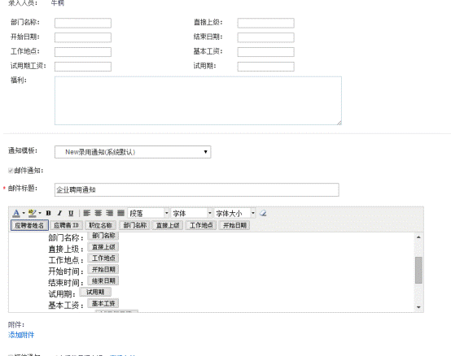
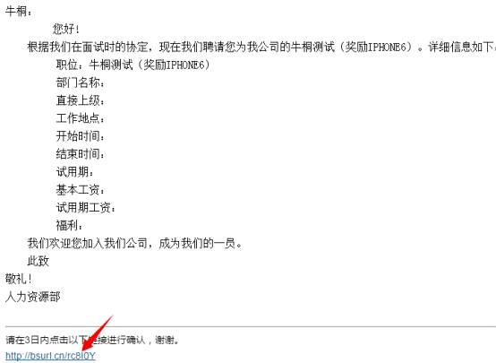
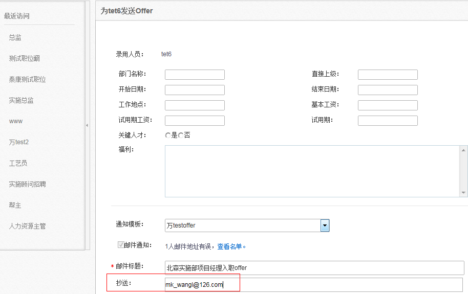

# 2.8.2 OFFER发送

OFFER审批结束通过后，可以对该应聘者进行OFFER的发放了，点击【发OFFER】，如下图：

同样，如果已经经过审批则相关内容会自动带入到对应的空白处，如果直接发送的OFFER则手工填写相关信息后，选择对应的模板，点击【发送】即可。

同样发送方式为邮件及短信方式，应聘者收到OFFER的通知后，可以回复是否加入，如下图：

 

 
发送offer时可以抄送任意一个人，如下图所示，mk_wangl@126是手工输入的邮箱。

