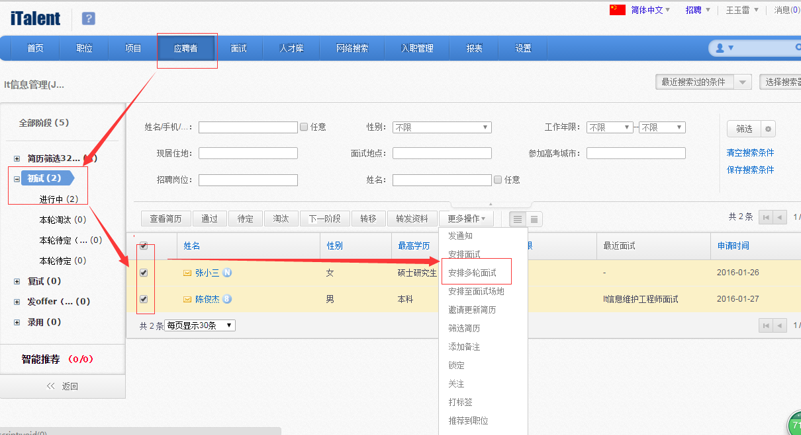
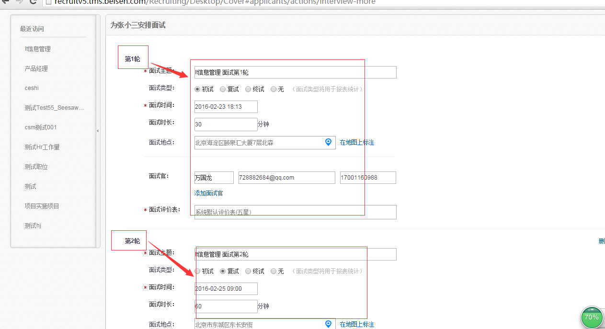
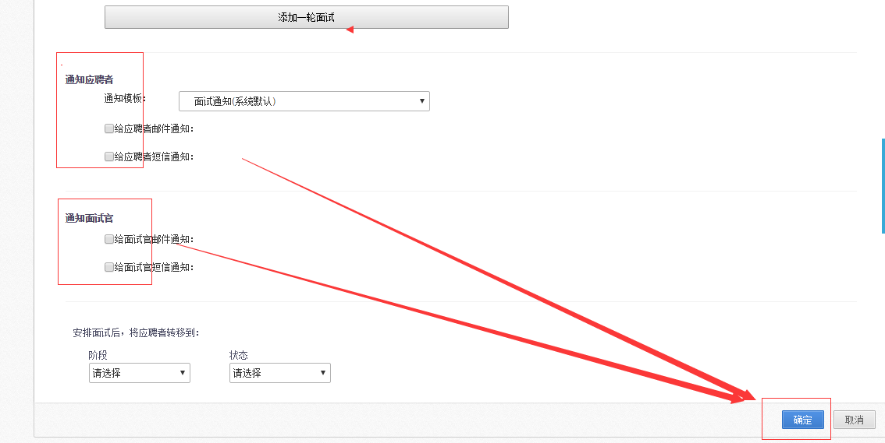

# 2.7.1 安排多轮面试

当面试者有多个面试轮次时可以使用【多轮面试】功能安排多轮面试，操作如下所示（只能针对一个人进行多轮面试操作）：

根据实际情况给相应的人员添加面试轮次。

最后选择

最后选择面试通知的对象以及模板完成 多轮面试操作。

多轮面试的注意事项：

多轮面试环节中有不通过的情况下，系统现有功能是需要手动取消面试通知，在实际应用过程中如果在这个阶段加上触发器(需定制，产生费用)，在面试未通过情况下自动发送取消面试通知，业务跟系统更加的连贯合理。

