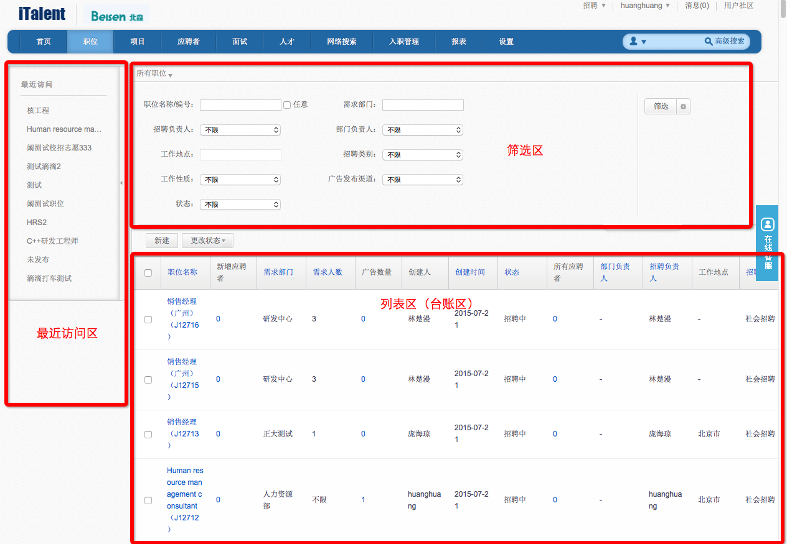
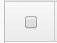
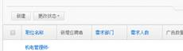

# 2.2 界面介绍

整个系统基本都是由三个区域组成，左上下，如下图：

通用说明：

1、最近访问区：通过最近访问区，可以直接快速的访问最近访问的职位进行处理。

2、筛选区：通过筛选区的条件对列表区的内容进行筛选。

3、列表区：对应功能下所有相关数据列表，此处为职位列表相关内容。

4、通过筛选按钮可以筛选列表区的内容，通过右边的小齿轮可以选择多个查询条件，同样列表区的小齿轮也可以选择多个查询条件。

5、这种带▼的标志表示有多个下拉选项可以选择。

6、这种方框为复选框，可以勾选一个或多个。

7、蓝色字体可以点击排序。

8、*****号为必填项

**注意：以上内容本手册中会多次出现时不在一一描述。**
